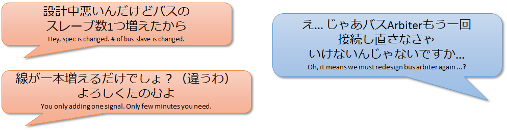
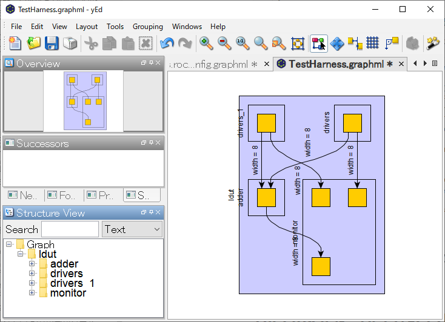
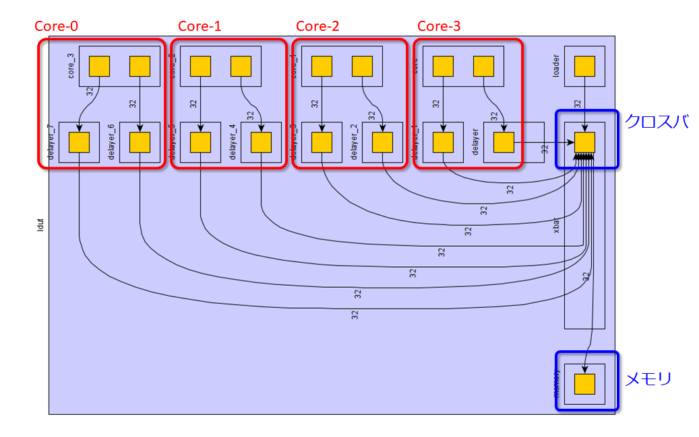

# ハードウェア記述言語Chiselを<span style="color: red">もっともっと</span>活用するためのDiplomacy概説


- 発表者：msyksphinz (FPGA開発日記著者)
- @msyksphinz_dev
- [https://msyksphinz.hatenablog.com](https://msyksphinz.hatenablog.com)


# Chisel使ってますか？


- Scalaをベースとしたハードウェア構築言語.
  - 高位合成言語ではない
- SiFiveのRISC-V IPで採用されている
- Rocket-Chip : [https://github.com/chipsalliance/rocket-chip](https://github.com/chipsalliance/rocket-chip)
- BOOM : [https://github.com/riscv-boom/riscv-boom](https://github.com/riscv-boom/riscv-boom)

- Chiselの基礎 : 「Chiselを始めたい人に読んで欲しい本」 [https://nextpublishing.jp/book/12162.html](https://nextpublishing.jp/book/12162.html)


# ChiselがVerilogを生成するまで

- ChiselはScalaのDSLなので、Chisel CompilerはScalaで記述してある

- Chisel Compilerは<span style="color:red">FIR (Flexible Interpretation Representation)</span>と呼ばれる中間言語を生成する

  - FIRはScalaの文法と関係ない

- FIRをFIRRTLという変換器を使ってVerilogに変換する

  - FIRRTLもScalaで記述してある (FIRはScalaのDSLではないので、Scalaで作る必要はないと思うけど...)[^circt]


```flow
st=>inputoutput: Chisel(Scala)
op1=>subroutine: Chisel Compiler
io=>inputoutput: FIR(IR)
sub1=>subroutine: FIRRTL Compiler
cond=>inputoutput: Verilog

st(right)->op1(right)->io(right)->sub1(right)->cond
cond(yes)->e
cond(no)->op1
```

[^circt]: FIRRTLの置き換えとして、Chris Lattner主導でLLVMとMLIRを使用した「CIRCT」というツールが開発されている [https://github.com/llvm/circt](https://github.com/llvm/circt)


# Chiselの何が良いのか？

- Scalaというソフトウェア記述言語の機能が使える
- → この結果Verilogエンジニアには<span style="color:red">一見理解できない意味不明な記述が時々登場する</span>

## 例：FIRフィルタ


### 解答例1. 初心者が書いた

```scala
// stage size is temporary 4
class My4ElementFir(b0: Int, b1: Int, b2: Int, b3: Int) extends Module {
  val io = IO(new Bundle {
    val in = Input(UInt(8.W))
    val out = Output(UInt(8.W))
  })

  val x_n1 = RegNext(io.in, 0.U)
  val x_n2 = RegNext(x_n1, 0.U)
  val x_n3 = RegNext(x_n2, 0.U)
  io.out := io.in * b0.U(8.W) + x_n1 * b1.U(8.W) +
             x_n2 * b2.U(8.W) + x_n3 * b3.U(8.W)
}
```

### 解答例2. 私(@msyksphinz)が書いた

<span style="color:red">ほぼVerilogじゃねーか！</span>

```scala
class MyManyDynamicElementVecFir(length: Int) extends Module {
  val io = IO(new Bundle {
    val in = Input(UInt(8.W))
    val valid = Input(Bool())
    val out = Output(UInt(8.W))
    val consts = Input(Vec(length, UInt(8.W)))
  })

  val taps = Reg(Vec(length, UInt(8.W)));
  for (i <- 0 until length) {
    if (i == 0) { when(io.valid) { taps(i) := io.in     } }
    else        { when(io.valid) { taps(i) := taps(i-1) } }
  }
  val w_fir_res = Wire(Vec(length, UInt(8.W)))
  for (i <- 0 until length) {
    val w_tap_mul = Wire(UInt(8.W))
    w_tap_mul := taps(i) * io.consts(i)
    if (i == 0) { w_fir_res(i) := 0.U }
    else        { w_fir_res(i) := w_tap_mul + w_fir_res(i-1) }
  }
  io.out := w_fir_res(length-1)
}
```


## 解答例3. 頭のおかしなChiselエンジニアが書いた

- <span style="color:red">一見じゃ理解できねーぞ？</span>

[https://github.com/freechipsproject/chisel-bootcamp/blob/master/2.5_exercise.ipynb](https://github.com/freechipsproject/chisel-bootcamp/blob/master/2.5_exercise.ipynb)

```scala
class MyManyDynamicElementVecFir(length: Int) extends Module {
  val io = IO(new Bundle {
    val in = Input(UInt(8.W))
    val valid = Input(Bool())
    val out = Output(UInt(8.W))
    val consts = Input(Vec(length, UInt(8.W)))
  })

  val taps = Seq(io.in) ++ Seq.fill(io.consts.length - 1)(RegInit(0.U(8.W)))
  taps.zip(taps.tail).foreach { case (a, b) => when (io.valid) { b := a } }

  io.out := taps.zip(io.consts).map { case (a, b) => a * b }.reduce(_ + _)
```


# 閑話休題：なぜChiselは<span style="color:green">Scala</span>を選んだか？

- ウワサ：UCBでChiselの初期版を作った時、<span style="color:red">Ruby</span>を使ったらコンパイルが劇遅であきらめた
  - まあScalaのコンパイルも速くないと思うけどね

- Scalaの特徴：頭がおかしいくらい演算子のオーバライドができる
  - 例1 : 通常のChisel記述での`A := B`と、TileLink内における`A := B`は意味が違う

```scala
 /** Connect this $coll to that $coll mono-directionally and element-wise.
    *
    * This uses the [[MonoConnect]] algorithm.
    *
    * @param that the $coll to connect to
    * @group Connect
    */
  final def := (that: Data)(implicit sourceInfo: SourceInfo, connectionCompileOptions: CompileOptions): Unit = this.connect(that)(sourceInfo, connectionCompileOptions) // scalastyle:ignore line.size.limit
```

- 例2：頭のおかしなAXIバス接続 (`src/main/scala/subsystem/Ports.scala`)

```scala
 mbus.coupleTo(s"memory_controller_port_named_$portName") {
    (memAXI4Node
      :*= AXI4UserYanker()
      :*= AXI4IdIndexer(idBits)
      :*= TLToAXI4()
      :*= TLWidthWidget(mbus.beatBytes)
      :*= _)
  }
```


# 本題に戻って：なぜChiselを使うの？


#### <span style="color:red">暴論：普通にハードウェア作りたいなら、Verilogの方が便利に決まっている！！！！</span>

- テストが書きやすい？ → UVMの方が高機能じゃない？
- エラー検出が優れている？ → 一般的な書き間違えのエラーならシミュレータで十分検出できる
- 私から見えているクラスタのChiselを使うための「<span style="color:red">言い訳</span>」
  - <span style="color:blue">Rocket-Chipが使っているからやむを得ず</span>
  - <span style="color:blue">新しい言語で何かを書いて皆に「すごい」って言ってほしい</span>


#### <span style="color:red">じゃあChiselの使いどころってどこよ？</span>

- <span style="color:blue">技術の進化が、ハードウェア設計の周期をはるかに上回ってきた</span>
- ハードウェアエンジニア、技術の進化に追いついてきている？
- チップ作るのに2～3年かかる。これで最先端AIチップ作れますか？
- DSAの時代、<span style="color:red">少量多品種</span>で作り上げなければならない
- (関係ないけど)少量多品種で弱者が簡単にチップを起こす時代が来るべき
- ハードウェアの「複雑性」どのように管理する？




# Chiselの使いどころ一例：<span style="color:red">Diplomacy</span>

- Parameter Negotiation Framework for generating parameterized protocol implementation.


# Diplomacyはどこから来たの？

- Andrew Watermanの博士論文：
  - Design of the RISC-V Instruction Set Architecture
  - [https://people.eecs.berkeley.edu/~krste/papers/EECS-2016-1.pdf](https://people.eecs.berkeley.edu/~krste/papers/EECS-2016-1.pdf)
- Yunsup Leeの博士論文：
  - Decoupled Vector-Fetch Architecture with a Scalarizing Compiler
  - [https://people.eecs.berkeley.edu/~krste/papers/EECS-2016-117.pdf](https://people.eecs.berkeley.edu/~krste/papers/EECS-2016-117.pdf)
- Henry Cookの博士論文：
  - <span style="color:red">Productive Design of Extensible On-Chip Memory Hierarchies</span>
  - Diplomacyの基本的なアイデアがこの論文に書いてある
  - [https://www2.eecs.berkeley.edu/Pubs/TechRpts/2016/EECS-2016-89.pdf](https://www2.eecs.berkeley.edu/Pubs/TechRpts/2016/EECS-2016-89.pdf)


# Diplomacyの実現したいこと

- 一つのデザインを使って柔軟なコンフィグレーションを実現する
- 一つのデザインから
  - 複数のCPUコンフィグレーション (RV64 / RV32)
  - 複数のバス構成・キャッシュ構成
    - コア数・バス幅、キャッシュサイズ、SoC構成


### 一つの実現例：SiFiveのCore IP Generator

- [https://scs.sifive.com/core-designer/](https://scs.sifive.com/core-designer/)


# 閑話休題：Chisel + Diplomacyを使って開発したいならIntelliJ IDEAを使おう

<span style="color:red">マジでAuto Completionの機能が無いと死ぬ。</span>


# 誤解：DiplomacyはTileLinkを使わないと使えないの？

そんなことはない。DiplomacyはChiselのライブラリなのでTileLinkを使わなくても使える。

## 例: Diplomacyで繋げたMultiple InputsのAdder


ここで読み解かなければならないのは以下の3つのモジュール：

- `AdderDriver` : 加算器に対してランダム値を送信するためのドライバー
- `AdderNode` : 加算器本体。2つ以上の`AdderDriver`が接続されその値をすべて足し合わせ、結果を出力する
- `AdderMonitor` : モニタ。`AdderDriver`の発信した値と`AdderNode`が生成した加算結果を突き合わせ、答え合わせをする機能を持つ

### AdderDriver

加算器に対してランダム値を送信するためのドライバー。`AdderDriver`を読み解くためのポイント：

1. <span style="color:red">`val node = new AdderDriverNode` って何？</span>
2. <span style="color:red">`new LazyModuleImp(this)`って何？</span>

```scala
// class モジュール名 extends LazyModule はDiplomacy経由で接続するためのモジュールだと思ってもらえれば.
class AdderDriver(width: Int, numOutputs: Int)(implicit p: Parameters) extends LazyModule {
    // 1. AdderDriverNodeとは何か、そもそも"node"はどのような役割を持つのか？
    val node = new AdderDriverNode(Seq.fill(numOutputs)(DownwardParam(width)))

    // 2. LazyModuleImp()とは何か、Diplomacy内でどのような役割を持つのか
    lazy val module = new LazyModuleImp(this) {
		...
        // drive signals
    	node.out.foreach { case (addend, _) => addend := randomAddend }
  	}
}

// AdderDriverNode は SourceNode クラスを継承して作成されたもの
class AdderDriverNode(widths: Seq[DownwardParam])(implicit valName: ValName)
  extends SourceNode(AdderNodeImp)(widths)
```

- `SourceNode`はマスターとなるノードに使用する。
- `SinkNode`はスレーブとなるノードに使用する。
- `AdapterNode`は複数のマスターと複数のスレーブを接続する。マスターとスレーブの数は同一でなければならない。
- `NexusNode`は複数のマスターと複数のスレーブを接続する。マスターとスレーブの数は同一でなくても良い。


#### 1. node : モジュール間を接続するためのもの

`node`はDiplomacyにおいてモジュール間で通信を行うための通信ポート。`node`間で様々なパラメータをやり取りし、パラメータの調停を行う役割を持つ。

`node`には2つの重要な要素がある。

- `bundle` : Diplomacyによって接続されるI/Oポートが含まれている。今回の場合はランダム値を送信するための信号が一束入っているだけ

- `edge` : Diplomacyのノード間を接続するためのパラメータ群が入っている。これらのパラメータをノード間で通信し最終的なノード間パラメータ調整（Diplomacy）を行う。

```scala
object AdderNodeImp extends SimpleNodeImp[DownwardParam, UpwardParam, EdgeParam, UInt] {
  // edge : Diplomacyのノード間を接続するためのパラメータ群が入っている。
  def edge(pd: DownwardParam, pu: UpwardParam, p: Parameters, sourceInfo: SourceInfo) = {
    if (pd.width < pu.width) EdgeParam(pd.width) else EdgeParam(pu.width)
  }

  // Diplomacyによって接続されるI/Oポートが含まれている。
  // UInt(e.width.W) : eはEdgeParam,つまりエッジのパラメータ
  def bundle(e: EdgeParam) = UInt(e.width.W)

  def render(e: EdgeParam) = RenderedEdge("blue", s"width = ${e.width}")
}
```

#### 2. `LazyModuleImp` : nodeの情報をもとに回路を実装する部分

`node`とのデータ通信をしつつ実際の処理を行うためのデジタル処理部。

```scala
  val node = new AdderDriverNode(Seq.fill(numOutputs)(DownwardParam(width)))

  lazy val module = new LazyModuleImp(this) {
    // すべてのノードのエッジからビット幅情報を取り出す
    val negotiatedWidths = node.edges.out.map(_.width)
    // すべてのノード間接続線のビット数が一致するか？
    require(negotiatedWidths.forall(_ == negotiatedWidths.head), "outputs must all have agreed on same width")

    // いつぃているならば、先頭ノードの情報を使用する (まあどのノードの情報を使っても同じだけど)
    val finalWidth = negotiatedWidths.head

    // FibonacciLFSRモジュールにより乱数を生成
    val randomAddend = FibonacciLFSR.maxPeriod(finalWidth)

    // 乱数をすべての出力ノードに対して送り込む
    node.out.foreach { case (addend, _) => addend := randomAddend }
  }
```

### Diplomacyを使う場合は、yEdを使ってノードグラフ図を確認しよう



<div align="center">図. yEdによりAdderグラフを生成した図</div>

- もっと複雑な例：Freedom-SoCで4コア構成作成時のノード接続関係図


<div align="center">図. freedom SoC ノード接続関係図</div>


# TileLinkを使った自作CPU＋多彩なバス接続を実現

### ちょっと自作CPUしてみる

- Chiselを使って自作CPUして、それにTileLinkを接続して簡単なマルチコアシステムを作ってみる。

#### 作ったCPUコア: RV64の簡単な5段パイプライン

まともに検証していないけどとりあえず`riscv-tests`程度は動くCPUコアを作った。

[https://github.com/msyksphinz-self/chisel-soc/tree/main/src/main/scala/core](https://github.com/msyksphinz-self/chisel-soc/tree/main/src/main/scala/core)


- フェッチバス・データバスは非常に単純なもの（非TileLink / 非AXIバス）

[https://github.com/msyksphinz-self/chisel-soc/blob/main/src/main/scala/core/cpu_bus.scala#L17](https://github.com/msyksphinz-self/chisel-soc/blob/main/src/main/scala/core/cpu_bus.scala#L17) (`InstBus`へのリンク)

[https://github.com/msyksphinz-self/chisel-soc/blob/main/src/main/scala/core/cpu_bus.scala#L30](https://github.com/msyksphinz-self/chisel-soc/blob/main/src/main/scala/core/cpu_bus.scala#L30) (`DataBus`へのリンク)

### 自作CPUをどのようにしてTileLinkに組み込んでSoCを構築するか？

1. 自作CPUをLazyModuleでラップする
2. `TileLink`のノードを定義する
3. TileLinkのノードと自作CPUのノードを接続する


<div align="center">図. 自作CPUのインタフェース構成</div>

- TileLinkのノードは2つ用意している。
  - 命令フェッチ用
  - データアクセス用
- どちらもTileLinkだが、自作CPUは独自バスプロトコルなので無理やり置き換えている。
  - これで、`CoreTop`モジュールはTileLinkのインタフェースを2つ持ったモジュールに置き換わる

```scala
	// TileLinkで定義した命令・データバスのClientNodeを内部に引っ張ってくる
	val (inst_out, inst_edge) = inst_node.out(0)
    val (data_out, data_edge) = data_node.out(0)
    val baseEnd = 0
    val (sizeEnd, sizeOff) = (inst_edge.bundle.sizeBits + baseEnd, baseEnd)
    val (sourceEnd, sourceOff) = (inst_edge.bundle.sourceBits + sizeEnd, sizeEnd)
    val beatBytes = inst_edge.bundle.dataBits

	// 自作CPUのインスタンス定義
    val cpu = Module(new Cpu(conf, hartid))

	// TileLinkのフェッチポートの信号と、自作CPUのフェッチポート(独自プロトコル)を接続
	inst_out.a.valid := cpu.io.inst_bus.req
    inst_out.a.bits.address := cpu.io.inst_bus.addr
    inst_out.a.bits.opcode := TLMessages.Get
	...
	cpu.io.inst_bus.ready := inst_out.a.ready
    cpu.io.inst_bus.ack := inst_out.d.valid
    cpu.io.inst_bus.rddata := inst_out.d.bits.data.asSInt

	// TileLinkのデータアクセスポートの信号と、自作CPUのデータアクセスポート(独自プロトコル)を接続
    data_out.a.valid := cpu.io.data_bus.req
    data_out.a.bits.address := cpu.io.data_bus.addr
    data_out.a.bits.opcode := TLMessages.Get
	...
	cpu.io.data_bus.ack := data_out.d.valid
    cpu.io.data_bus.rddata := data_out.d.bits.data.asSInt
```

### TileLinkモジュールを持っCoreTopを使ってSoCを作る

`CoreTop`とメモリモジュールを持つ`CoreComplex`モジュールを作成してこれらを接続する。

```scala
class core_complex[Conf <: RVConfig]
  (conf: Conf, numCores: Int, ramBeatBytes: Int, txns: Int)(implicit p: Parameters)
  extends LazyModule {
  // 外部からメモリにデータアクセスするためのデータローダ
  val loader = LazyModule(new loader("loader"))

  // CPUコア(numCore分だけ複数個インスタンス化する)
  val core   = Seq.tabulate(numCores) { case i => LazyModule(new CoreTop(conf, i, "core" + i.toString)) }
  // TileLinkのクロスバ
  val xbar   = LazyModule(new TLXbar)
  // TileLinkインタフェースを持つメモリ
  val memory = LazyModule(new TLRAM(AddressSet(0x80000000L, 0x0ffff), beatBytes = ramBeatBytes))

  // クロスバにデータローダを接続する
  xbar.node := loader.node
  core.foreach { case (core) => {
    // クラスバにCPUコアの命令フェッチポートとデータポートを接続する
    xbar.node := TLDelayer(0.1) := core.inst_node
    xbar.node := TLDelayer(0.1) := core.data_node
  }
  }
  // クロスバをメモリに接続する
  memory.node := xbar.node

```


<div align="center">図. 自作CPUをTileLinkを通じてメモリに接続し、簡単なSoCを構成する</div>

### `numCores`を>1にして簡単にマルチコア構成を実現

上記のChiselの記述ならば、簡単にマルチコアにできる。`nCores`に2, 3, ... を設定するだけで自動的にクロスバに複数のCPUが接続されるようになる。


<div align="center">図. 自作CPUをTileLinkを通じてメモリに接続する。コア数=4の場合</div>

- 簡単にシミュレーションしてみた例。とりあえず4コアが同時にリクエストしても上手くメモリアクセスをArbitrationできている。


<div align="center">図. 4コア構成でのRTLシミュレーションの様子</div>

- 4コア構成にした場合のDiplomacyノード構成の例



<div align="center">図. 4コア構成でのDiplomacy接続関係図</div>


# RocketTileを例にバスの繋げ方を学ぼう

- RISC-V の CPU実装代表格：Rocket-Chip [https://github.com/chipsalliance/rocket-chip](https://github.com/chipsalliance/rocket-chip)

### Rocket-Chip Generator：なぜ「Generator」と名前が付けられているのか分かりますか？

- Rocket-Chipはデザインだけでなく、デザイン間の調整を行うためのDiplomacyや、Chisel実装・FIRRTL実装自体も含まれている総合パッケージとなっている。
- Scalaによる実装だけでなくハードウェアを生成するためのすべてのエンジンを含んでいるため、「Generator」と呼ばれている。

## Rocket-Chipの`DefaultConfig`のDiplomacy構成を見てみよう

Rocket-Chipのバス接続は基本的にTileLinkとDiplomacyを使って構成されている。


もう少し噛み砕いてみる。

バス接続部を見てみる。

## RocketTileで学ぶDiplomacyによるデバイスの接続

- RocketTile : RocketChipとDCacheなどの基本的な構成をすべて含んだ基本的なCPUコア1要素。
  - CPUベンダの中では、"CoreComplex"とも言ったりするかなあ... なんで"Core Complex"って言うんだろう？良く分からん。

### Rocket-Chipによる(簡単な)メモリマップ

| Start Address | Stop Address | Attributes | Explanation             |
| ------------- | ------------ | ---------- | ----------------------- |
| 0x0000_0000   | 0x0000_1000  | ARWX       | debug-controller@0      |
| 0x0000_3000   | 0x0000_4000  | ARWX       | error-device@3000       |
| 0x0001_0000   | 0x0002_0000  | RX         | rom@10000               |
| 0x0200_0000   | 0x0200_1000  | ARW        | clint@2000000           |
| 0x0c00_0000   | 0x1000_0000  | ARW        | interrupt_controller    |
| 0x6000_0000   | 0x8000_0000  | RWX        | mmio-port-axi4@60000000 |
| 0x8000_0000   | 0x9000_0000  | RWXC       | memory@8000_0000        |


## RocketTileの中身

```verilog
module RocketTile( // @[:freechips.rocketchip.system.DefaultConfig.fir@200426.2]

  TLXbar_8 tlMasterXbar ();

  IntXbar_4 intXbar ();

  DCache dcache ();

  Frontend frontend ();

  TLBuffer_9 buffer ();

  IntSyncCrossingSink intsink ();

  IntSyncCrossingSink_1 intsink_1 ();

  IntSyncCrossingSink_2 intsink_2 ();

  IntSyncCrossingSink_2 intsink_3 ();

  FPU fpuOpt ();

  HellaCacheArbiter dcacheArb ();

  PTW ptw ();

  Rocket core ();
```

重要な部分を抜粋して図を作ってみた。<span style="color:blue">青がLazyModule</span>、<span style="color:red">赤が通常Module</span>。


これをScalaから同読み解けばいいのさ？という話で、いくつか例を挙げてどのようにしてノード間が接続されているのか見てみよう。

- `RocketTile.scala`で当該部分を見てみよう。

```scala
class RocketTile private(
      val rocketParams: RocketTileParams,
      crossing: ClockCrossingType,
      lookup: LookupByHartIdImpl,
      q: Parameters,
      logicalTreeNode: LogicalTreeNode)
    extends BaseTile(rocketParams, crossing, lookup, q)
    with SinksExternalInterrupts
    with SourcesExternalNotifications
    with HasLazyRoCC  // implies CanHaveSharedFPU with CanHavePTW with HasHellaCache
    with HasHellaCache
    with HasICacheFrontend
{
/* ... */
	override lazy val module = new RocketTileModuleImp(this)
/* ... */
}
```

- `RocketTileModuleImp`はどのような実装になっているのか？

```scala
// "outer" は 上記の RocketTile に相当する
class RocketTileModuleImp(outer: RocketTile) extends BaseTileModuleImp(outer)
    with HasFpuOpt
    with HasLazyRoCCModule
    with HasICacheFrontendModule {
/* ... */
  val core = Module(new Rocket(outer)(outer.p))
/* ... */
  outer.frontend.module.io.cpu <> core.io.imem
  dcachePorts += core.io.dmem // TODO outer.dcachePorts += () => module.core.io.dmem ??

  /* FPUについてはオプションによっては接続する */
  fpuOpt foreach { fpu => core.io.fpu <> fpu.io }

  /* DCacheをデータキャッシュのアービタに接続する */
  dcacheArb.io.requestor <> dcachePorts
  ptw.io.requestor <> ptwPorts

```

- FPUを接続する部分（ここはDiplomacyを使っていない）


- DCacheを接続する部分


## Rocket-ChipのSoC部分の構成を読み解こう

- Rocket-Chip GeneratorでVerilogを生成すると、`TestHarness`というトップモジュールが生成されるが、これがテスト実行用のモジュールとなる。
  - これもVerilogの力を借りずすべてChiselから生成されている。
- `src/main/scala/system/TestHarness.scala`

```scala
class TestHarness()(implicit p: Parameters) extends Module {
  val io = new Bundle {
    val success = Bool(OUTPUT)
  }

  val ldut = LazyModule(new ExampleRocketSystem) // ExampleRocketSystemのインスタンス化.
  val dut = Module(ldut.module)  // ExmapleRocketSystemはLazyModuleなので、その内部にある実体をdutとして取り出す

  dut.dontTouchPorts()
  dut.tieOffInterrupts()
  SimAXIMem.connectMem(ldut)		// object SimAXIMemをインスタンス化してldutのメモリポートを接続
  SimAXIMem.connectMMIO(ldut)		// object SimAXIMemをインスタンス化してldutのMMIOポートを接続
  ldut.l2_frontend_bus_axi4.foreach(_.tieoff)	// ldutのフロントエンドポートはTie Zeroする
```

- `SimAXIMem.connectMem(ldut)`の部分を除いてみる

```scala
  def connectMem(dut: CanHaveMasterAXI4MemPort)(implicit p: Parameters): Seq[SimAXIMem] = {
    // ExampleRocketSystemのmem_axi4はioポートを示している
    // dut.memAXI4Node.inはLazyModuleのSlavePortノード
    dut.mem_axi4.zip(dut.memAXI4Node.in).map { case (io, (_, edge)) =>
      // 新たにAXI4メモリをインスタンス化する
      // メモリのサイズはAXIノードのedge情報に依存する
      val mem = LazyModule(new SimAXIMem(edge, size = p(ExtMem).get.master.size))
      Module(mem.module).suggestName("mem")
      // メモリインスタンスのI/OポートとldutのAXIポートを接続する
      mem.io_axi4.head <> io
      mem
    }
  }
```

- AXI4メモリポートの仕組み (`src/main/scala/subsystem/Ports.scala`)

```scala
/** Adds a port to the system intended to master an AXI4 DRAM controller. */
trait CanHaveMasterAXI4MemPort { this: BaseSubsystem =>
  private val memPortParamsOpt = p(ExtMem)
  private val portName = "axi4"
  private val device = new MemoryDevice
  private val idBits = memPortParamsOpt.map(_.master.idBits).getOrElse(1)
  // AXI4のDiplomacy スレーブノードを作る。
  // なぜスレーブなのかは、内部のTileLink (master) がマスターで、AXI4ノードがスレーブだから
  val memAXI4Node = AXI4SlaveNode(memPortParamsOpt.map({ case MemoryPortParams(memPortParams, nMemoryChannels) =>
    Seq.tabulate(nMemoryChannels) { channel =>
      val base = AddressSet.misaligned(memPortParams.base, memPortParams.size)
      val filter = AddressSet(channel * mbus.blockBytes, ~((nMemoryChannels-1) * mbus.blockBytes))
...
  // mbus (memory bus) に対してノードの接続を行う。
  mbus.coupleTo(s"memory_controller_port_named_$portName") {
    (memAXI4Node							// AXIのメモリノード
      :*= AXI4UserYanker()					// ↑ AXI4プロトコルにUserフィールドを付加する
      :*= AXI4IdIndexer(idBits)				// ↑ AXI4のIDビットを拡張する
      :*= TLToAXI4()						// ↑ AXI4にプロトコルを変更する
      :*= TLWidthWidget(mbus.beatBytes)		// ↑ mbus(TileLink)のバス幅を変更する
      :*= _)								// ↑ これはmbusの意味
  }

  val mem_axi4 = InModuleBody { memAXI4Node.makeIOs() }
}
```

- 注 : MMIOまで何でメモリに繋がってるの？と思わるかもしれないが、これはテスト環境なので自動的にメモリが接続されている。


# Config / Parameterを使ったConfigurableなモジュールの作り方

## <span style="color:blue">モチベーション：Rocket-Chipはなんでこんなに生成できるVerilogのバリエーションが多いの？</span>

```sh
$ make CONFIG=DefaultConfig		# RV64GC構成を生成
$ make CONFIG=RV32Config		# RV32GC構成を生成
$ make CONFIG=DualCoreConfig	# 2コア構成のSoCを生成
$ make CONFIG=RoCCExampleConfig	# RoCC (Rocket Custom Coprocessor) 付きの構成を生成
```

### 各機能がModularityを維持しつつ分割されているから


<div align="center">図. Rocket-Chip + SoCの構成は各モジュールが非常に独立性高く設計されている</div>

- `src/main/scala/system/Configs.scala`

```scala
class BaseConfig extends Config(
  new WithDefaultMemPort() ++
  new WithDefaultMMIOPort() ++
  new WithDefaultSlavePort() ++
  new WithTimebase(BigInt(1000000)) ++ // 1 MHz
  new WithDTS("freechips,rocketchip-unknown", Nil) ++
  new WithNExtTopInterrupts(2) ++
  new BaseSubsystemConfig()
)

class DefaultConfig extends Config(new WithNBigCores(1) ++ new WithCoherentBusTopology ++ new BaseConfig)
 
class DefaultBufferlessConfig extends Config(new WithBufferlessBroadcastHub ++ new DefaultConfig)
class DefaultSmallConfig extends Config(new WithNSmallCores(1) ++ new WithCoherentBusTopology ++ new BaseConfig)
class DefaultRV32Config extends Config(new WithRV32 ++ new DefaultConfig)
 
class DualBankConfig extends Config(new WithNBanks(2) ++ new DefaultConfig)
class DualCoreConfig extends Config(new WithNBigCores(2) ++ new WithCoherentBusTopology ++ new BaseConfig)
class DualChannelConfig extends Config(new WithNMemoryChannels(2) ++ new DefaultConfig)
class EightChannelConfig extends Config(new WithNMemoryChannels(8) ++ new DefaultConfig)
 
class DualChannelDualBankConfig extends Config(
  new WithNMemoryChannels(2) ++
  new WithNBanks(4) ++ new DefaultConfig)
 
class RoccExampleConfig extends Config(new WithRoccExample ++ new DefaultConfig)
```

上記の`class DualBankConfig extends Config(new WithNBanks(2) ++ new DefaultConfig)`はどういう意味か？ `Config`と`Parameter`について見る。


## パラメータを渡すためのいくつかのテクニック: Config

### Configの考え方：「<span style="color:blue">このモジュールに対してはこのパラメータを適用する</span>」の参照テーブル（マップ関数）を構築する

### ⇔ Verilogの場合「<span style="color:red">パラメータをトップから降ろしていく/packageによる一元管理</span>」


<div align="center">図. Verilogのパラメータを階層で降ろしていく（なんとなくの）イメージ</div>

#### ChiselのConfigの場合：Keyに対する辞書を作って、モジュール内で必要なKeyからパラメータを取得

```sh
$ grep -h -R Key | grep Field
```

```scala
case object APBDebugRegistersKey extends Field[Map[Int, Seq[RegField]]](Map())
case object DebugModuleKey extends Field[Option[DebugModuleParams]](Some(DebugModuleParams()))
case object DebugModuleHartSelKey extends Field(DebugModuleHartSelFuncs())
case object JtagDTMKey extends Field[JtagDTMConfig](new JtagDTMKeyDefault())
case object CLINTKey extends Field[Option[CLINTParams]](None)
...
case object SubsystemDriveAsyncClockGroupsKey extends Field[Option[ClockGroupDriverParameters]](Some(ClockGroupDriverParameters(1)))
case object AsyncClockGroupsKey extends Field[ClockGroupEphemeralNode](ClockGroupEphemeralNode()(ValName("async_clock_groups")))
case object BroadcastKey extends Field(BroadcastParams())
case object RocketTilesKey extends Field[Seq[RocketTileParams]](Nil)
case object RocketCrossingKey extends Field[Seq[RocketCrossingParams]](List(RocketCrossingParams()))
case object PeripheryMaskROMKey extends Field[Seq[MaskROMParams]](Nil)
...
case object PSDTestModeBroadcastKey extends Field(
```

辞書を作っているような感覚だと思ってもらえればよい：

| 検索元                 |      | 検索先の型                | 補足                                                         |
| ---------------------- | ---- | ------------------------- | ------------------------------------------------------------ |
| `APBDebugRegistersKey` | →    | `Map[Int, Seq[RegField]]` |                                                              |
| `RocketTilesKey`       | →    | `Seq[RocketTileParams]]`  | 何故`Seq`で囲まれているのか→<br />RocketTileはマルチコア構成だと複数配置されるので、それぞれTileのために`RocketTileParams`が複製されている |
| `PeripheryMaskROMKey`  | →    | `Seq[MaskROMParams]`      |                                                              |

例えば、`RocketTileParams`は以下のような定義になっている。ちょうどSystem Verilogの`package`のようなものと解釈すれば良い？

```scala
case class RocketCoreParams(
  bootFreqHz: BigInt = 0,
  useVM: Boolean = true,
  useUser: Boolean = false,
  useDebug: Boolean = true,
...
```

ではもう一度`DualCoreConfig`の定義に立ち戻って...

- `DualCoreConfig`は`Config`クラスを継承したもの。`Config`クラスはViewに基づいた辞書テーブルの変換関数の集合と考えて良い。これらの辞書テーブルの変換関数の集合は、最終的に`Parameter`として集約されデザインに渡される。


各モジュールで、ここで定義したパラメータを呼び出して具体的な値を入手する。

- `src/main/scala/rocket/RocketCore.scala`

```scala
trait HasRocketCoreParameters extends HasCoreParameters {
  lazy val rocketParams: RocketCoreParams = tileParams.core.asInstanceOf[RocketCoreParams]

  val fastLoadWord = rocketParams.fastLoadWord
  val fastLoadByte = rocketParams.fastLoadByte

  val mulDivParams = rocketParams.mulDiv.getOrElse(MulDivParams()) // TODO ask andrew about this

  require(!fastLoadByte || fastLoadWord)
}
```

```scala
@chiselName
class Rocket(tile: RocketTile)(implicit p: Parameters) extends CoreModule()(p)
    with HasRocketCoreParameters
    with HasCoreIO {

  val clock_en_reg = RegInit(true.B)
...
  // multiplier and divider
  val div = Module(new MulDiv(if (pipelinedMul) mulDivParams.copy(mulUnroll = 0) else mulDivParams, width = xLen))
  div.io.req.valid := ex_reg_valid && ex_ctrl.div
  div.io.req.bits.dw := ex_ctrl.alu_dw
  div.io.req.bits.fn := ex_ctrl.alu_fn
...
```


- `src/main/scala/rocket/Multiplier.scala`

```scala
class MulDiv(cfg: MulDivParams, width: Int, nXpr: Int = 32) extends Module {
  private def minDivLatency = (cfg.divUnroll > 0).option(if (cfg.divEarlyOut) 3 else 1 + w/cfg.divUnroll)
  private def minMulLatency = (cfg.mulUnroll > 0).option(if (cfg.mulEarlyOut) 2 else w/cfg.mulUnroll)
  def minLatency: Int = (minDivLatency ++ minMulLatency).min

  val io = IO(new MultiplierIO(width, log2Up(nXpr)))
...
  val req = Reg(chiselTypeOf(io.req.bits))
  val count = Reg(UInt(log2Ceil(
    ((cfg.divUnroll != 0).option(w/cfg.divUnroll + 1).toSeq ++
     (cfg.mulUnroll != 0).option(mulw/cfg.mulUnroll)).reduce(_ max _)).W))

```

### `here()`, `site()`, `up()`などの使い方

- `Config`で使用しているパラメータを計算するにあたり、さらに別のパラメータの値を使用したい場合どうするか。Verilogでいう以下のようなことを実現したい場合を考える。

```verilog
localparam param1 = 100;
localparam param2 = param1 * 100;
```

これをChiselで実現しようしようとすると以下のようになるだろう。`BusWidthBytes`パラメータを使用してアドレスサイズの計算をしている。

```scala
class Bus128BitConfig extends Config((site, here, up) => {
  case BusWidthBytes => 128 / 8
  // BusWidthBytes はcase classなので整数ではない
  case AddrSize => 0x100 * BusWidthBytes
})

class Bus64BitConfig extends Config((site, here, up) => {
  case BusWidthBytes => 64 / 8
  // BusWidthBytes はcase classなので整数ではない
  case AddrSize => 0x200 * BusWidthBytes
})

[error] /home/msyksphinz/work/riscv/chisel-development/minimal-diplomacy/src/main/scala/core_complex/Configs.scala:11:26: overloaded method value * with alternatives:
[error]   (x: Double)Double <and>
[error]   (x: Float)Float <and>
[error]   (x: Long)Long <and>
[error]   (x: Int)Int <and>
[error]   (x: Char)Int <and>
[error]   (x: Short)Int <and>
[error]   (x: Byte)Int
[error]  cannot be applied to (core_complex.BusWidthBytes.type)
[error]   case AddrSize => 0x100 * BusWidthBytes  // <-- BusWidthBytes は数値じゃない！
[error]                          ^
```

ようするに`BusWidthBytes`自体がcase classなので、値として直接使用することができない。そこで、同じ`Config`内の値を参照するための`here()`などの情報を使用して辞書サーチをする。

```scala
class Bus128BitConfig extends Config((site, here, up) => {
  case BusWidthBytes => 128 / 8
  case AddrSize => 0x100 * here(BusWidthBytes)
})

class Bus64BitConfig extends Config((site, here, up) => {
  case BusWidthBytes => 64 / 8
  case AddrSize => 0x200 * here(BusWidthBytes)
})
// Bus128BitConfigで構成したTLRAM, 12ビットのバス幅で構成される
module TLRAM(
  input         clock,
  input         reset,
  input         auto_in_a_valid,
  input  [2:0]  auto_in_a_bits_opcode,
  input  [11:0] auto_in_a_bits_address,
  input  [31:0] auto_in_a_bits_data,
  output        auto_in_d_valid,
  output [2:0]  auto_in_d_bits_opcode,
  output [31:0] auto_in_d_bits_data
);
```

一方で、`site()`を使用するとより上位のConfigを使用するようになる。例えば`Default2Config`では以下のように構成している。

- `sites()`を使用するケース：`Bus128BitConfig`で`site()`を使用すると`BaseConfig`を参照する。つまり`AddrSize`は`0x100 * (256/8)`になるはずだ。

```scala
class Default2Config extends Config(
  new BaseConfig ++
  new Bus128BitConfig ++ new IfuNotConnectConfig
)
class BaseConfig extends Config((site, here, up) => {
  case BusWidthBytes => 256 / 8
})

class Bus128BitConfig extends Config((site, here, up) => {
  case BusWidthBytes => 128 / 8
  case AddrSize => 0x100 * here(BusWidthBytes)
})
// BaseConfigで構成したTLRAM, 13ビットのバス幅で構成される
module TLRAM(
  input          clock,
  input          reset,
  input          auto_in_a_valid,
  input  [2:0]   auto_in_a_bits_opcode,
  input  [12:0]  auto_in_a_bits_address,
  input  [255:0] auto_in_a_bits_data,
  output         auto_in_d_valid,
  output [2:0]   auto_in_d_bits_opcode,
  output [255:0] auto_in_d_bits_data
);
```

- `up()`を使用するケース：以下では、`Adder()`と`Mul()`の2つのモジュールを定義している。`p(BitWidth)`で入出力ビット数を定義している。`Adder()`と`Mul()`のビット幅を全く別物で定義したい場合どうするかという問題を考える。

```scala
class Adder()(implicit p: Parameters) extends Module {
  val bitwidth = p(BitWidth)
  val io = IO(new Bundle{
    val a = Input(SInt(bitwidth.W))
    val b = Input(SInt(bitwidth.W))
    val c = Output(SInt(bitwidth.W))
  })

  io.c := io.a + io.b
}

class Mul()(implicit p: Parameters) extends Module {
  val bitwidth = p(BitWidth)
  val io = IO(new Bundle{
    val a = Input(SInt(bitwidth.W))
    val b = Input(SInt(bitwidth.W))
    val c = Output(SInt((bitwidth * 2).W))
  })

  io.c := io.a * io.b
}
```

この時、`Adder()`と`Mul()`のパラメータは以下のように定義している。`Adder()`は64ビット、`Mul()`は128ビットの入力ビット幅でインスタンス化するものとする。

```scala
case object AdderBitWidth extends Field[Int]
case object MulBitWidth extends Field[Int]

class DefaultConfig() extends Config((site, here, up) => {
  case AdderBitWidth => 64
  case MulBitWidth => 128
})
```

`Adder()`と`Mul()`をインスタンス時にそれぞれのパラメータをオーバライドするわけだが、`adder_param`と`mul_param`を新たに定義して渡すことになる。

```scala
  val Adder_mod = Module(new Adder()(adder_params))
  Adder_mod.io.a := io.a
  Adder_mod.io.b := io.b
  io.Adder_c := Adder_mod.io.c

  val mul_mod = Module(new Mul()(mul_params))
  mul_mod.io.a := io.a
  mul_mod.io.b := io.b
  io.mul_c := mul_mod.io.c
```

ここで、`adder_params`は上記の`DefaultConfig`を引き継ぎつつ、`BitWidth`パラメータを継承前の`DefaultConfig`で使用しているパラメータで引き継ぐ。この時に`up()`を使用する。これにより、`

```scala
  val adder_params = p.alter((site, here, up) => {
    case BitWidth => up(AdderBitWidth)
  })

  val mul_params = p.alter((site, here, up) => {
    case BitWidth => up(MulBitWidth)
  })
```

`adder_params`の`BitWidth`は`DefaultConfig`の`AdderBitWidth`を引き継ぎ、`mul_params`の`BitWidth`は`DefaultConfig`の`MulBitWidth`を引き継ぐことになる。これにより、同じ`BitWidth`パラメータでも別々のパラメータを引き継ぐことが可能になる。

結果は以下の通り、`Adder`の入力ビット幅は`AddrBitWidth`を引き継いで64ビットとなり、`Mul`の入力ビット幅は`MulBitWidth`を引き継いで128ビットとなった。

```verilog
module Adder(
  input  [63:0] io_a,
  input  [63:0] io_b,
  output [63:0] io_c
);
  assign io_c = $signed(io_a) + $signed(io_b); // @[up_example.scala 48:8]
endmodule
module Mul(
  input  [127:0] io_a,
  input  [127:0] io_b,
  output [255:0] io_c
);
  assign io_c = $signed(io_a) * $signed(io_b); // @[up_example.scala 59:8]
endmodule
```

# まとめ

- Chiselの活用ポイント → コア中ではなくネットワーク部。柔軟性が求められる部分。
- Diplomacyを使って自作CPUのバスネットワークに接続する
- Rocket-Chipのバス部分は大量のDiplomacyバス構成で構築されている
- `Config`/`Parameter`でより柔軟なパラメタライズを行う
