# Hardware Description Language Chisel & Diplomacy <span style="color:red">Deeper</span> dive


- Presenter：msyksphinz (Author of FPGA development diary)
- @msyksphinz_dev
- https://msyksphinz.hatenablog.com


# About Presenter

- Interesting Topic: Computer Architecture, Low-Layer Programming
  - X86 (Studying via implementation of QEMU with Rust)
  - MIPS (Studied through implementation Instruction Set Simulator)
  - ARM (Studying ...)
  - <span style="color: red">RISC-V</span>
- My work : Hardware development
  - General Processor, Accelerator, and so on ...
  - HDL skill: Verilog, System Verilog (except UVM), Chisel
  - My first HDL I studied is VHDL (already I forget)
  - When I was a student, I implemented MIPS CPU by myself and run it on Spartan-3 FPGA.
- Low Layer Programming

  - I started my work by analyzing and verifying the performance of general-purpose CPUs, so I can do some low-layer programming (I think).
  - I like QEMU and LLVM.
  - When I learn a new ISA, I start by building an instruction set simulator!
- Other
  - Programming Languages: C++ / Ruby / Rust
  - I'm addicted to Rust lately... <span style="color:red">Hey, isn't it full of `unsafe` when you write low-layer stuff? :)</span>.
  - FPGA: I only know Xilinx & haven't touched it for a few years now (even though this is an FPGA development diary)

# Are you using Chisel?


- A hardware building language based on Scala.
  - Not a high-level synthesis language.
- SiFive's RISC-V IP use Chisel
- Rocket-Chip : https://github.com/chipsalliance/rocket-chip
- BOOM : https://github.com/riscv-boom/riscv-boom

- Chisel Basics : "Chiselを始めたい人に読んで欲しい本" https://nextpublishing.jp/book/12162.html

# How Chisel generates Verilog

- Chisel is a Scala DSL, so the Chisel Compiler is written in Scala.

- Chisel Compiler generates an intermediate language called <span style="color:red">FIR (Flexible Interpretation Representation)</span>.

  - FIR has nothing to do with Scala's syntax

- FIR is converted to Verilog using a converter called FIRRTL

  - FIRRTL is also written in Scala (FIR is not a Scala DSL, so I don't think it needs to be written in Scala...) [^circt].


```flow
st=>inputoutput: Chisel(Scala)
op1=>subroutine: Chisel Compiler
io=>inputoutput: FIR(IR)
sub1=>subroutine: FIRRTL Compiler
cond=>inputoutput: Verilog

st(right)->op1(right)->io(right)->sub1(right)->cond
cond(yes)->e
cond(no)->op1
```

[^circt]: As a replacement for FIRRTL, a Chris Lattner-led tool called "CIRCT" has been developed using LLVM and MLIR https://github.com/llvm/circt


# What's good about Chisel?

- You can use the features of Scala, a software description language.
- → This results in Verilog engineers <span style="color:red">sometimes having to write seemingly incomprehensible and unintelligible statements</span>.

## Example: FIR Filter

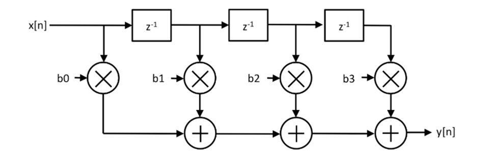

### Answer 1. By beginner

```scala
// stage size is temporary 4
class My4ElementFir(b0: Int, b1: Int, b2: Int, b3: Int) extends Module {
  val io = IO(new Bundle {
    val in = Input(UInt(8.W))
    val out = Output(UInt(8.W))
  })

  val x_n1 = RegNext(io.in, 0.U)
  val x_n2 = RegNext(x_n1, 0.U)
  val x_n3 = RegNext(x_n2, 0.U)
  io.out := io.in * b0.U(8.W) + x_n1 * b1.U(8.W) +
             x_n2 * b2.U(8.W) + x_n3 * b3.U(8.W)
}
```

### Answer 2. Written by me (hardware enginner)

<span style="color:red">Almost Verilog!</span>

```scala
class MyManyDynamicElementVecFir(length: Int) extends Module {
  val io = IO(new Bundle {
    val in = Input(UInt(8.W))
    val valid = Input(Bool())
    val out = Output(UInt(8.W))
    val consts = Input(Vec(length, UInt(8.W)))
  })

  val taps = Reg(Vec(length, UInt(8.W)));
  for (i <- 0 until length) {
    if (i == 0) { when(io.valid) { taps(i) := io.in     } }
    else        { when(io.valid) { taps(i) := taps(i-1) } }
  }
  val w_fir_res = Wire(Vec(length, UInt(8.W)))
  for (i <- 0 until length) {
    val w_tap_mul = Wire(UInt(8.W))
    w_tap_mul := taps(i) * io.consts(i)
    if (i == 0) { w_fir_res(i) := 0.U }
    else        { w_fir_res(i) := w_tap_mul + w_fir_res(i-1) }
  }
  io.out := w_fir_res(length-1)
}
```


### Answer 3. Written by Chisel Expert

- <span style="color:red">Can't understand?</span>

https://github.com/freechipsproject/chisel-bootcamp/blob/master/2.5_exercise.ipynb

```scala
class MyManyDynamicElementVecFir(length: Int) extends Module {
  val io = IO(new Bundle {
    val in = Input(UInt(8.W))
    val valid = Input(Bool())
    val out = Output(UInt(8.W))
    val consts = Input(Vec(length, UInt(8.W)))
  })

  val taps = Seq(io.in) ++ Seq.fill(io.consts.length - 1)(RegInit(0.U(8.W)))
  taps.zip(taps.tail).foreach { case (a, b) => when (io.valid) { b := a } }

  io.out := taps.zip(io.consts).map { case (a, b) => a * b }.reduce(_ + _)
```


# BTW, Why did Chisel choose <span style="color:green">Scala</span>?

- Rumor: When we built the first version of Chisel at UCB, we used <span style="color:red">Ruby</span> and it compiled so slowly that we gave up.
  - Well, I don't think Scala compiles fast either.

- Scala's feature: crazy operator overrides
  - Example 1 : `A := B` in normal Chisel description and `A := B` in TileLink have different meanings

```scala
 /** Connect this $coll to that $coll mono-directionally and element-wise.
    *
    * This uses the [[MonoConnect]] algorithm.
    *
    * @param that the $coll to connect to
    * @group Connect
    */
  final def := (that: Data)(implicit sourceInfo: SourceInfo, connectionCompileOptions: CompileOptions): Unit = this.connect(that)(sourceInfo, connectionCompileOptions) // scalastyle:ignore line.size.limit
```

- Example 2. Crazy AXI Bus connection (`src/main/scala/subsystem/Ports.scala`)

```scala
 mbus.coupleTo(s"memory_controller_port_named_$portName") {
    (memAXI4Node
      :*= AXI4UserYanker()
      :*= AXI4IdIndexer(idBits)
      :*= TLToAXI4()
      :*= TLWidthWidget(mbus.beatBytes)
      :*= _)
  }
```


# Back on topic: Why use Chisel?

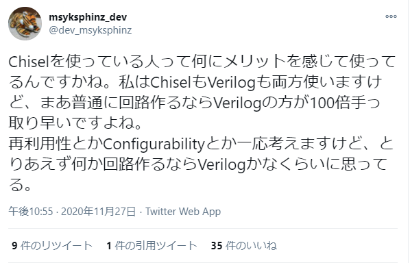

#### <span style="color:red">Rant: If you want to make regular hardware, Verilog is definitely more convenient: ！！！！ </span>.

- Easier to write tests? → Isn't UVM more sophisticated?
- Does it have better error detection? → The simulator is good enough to detect common writing errors.
- <span style="color:red">Reason</span> for using Chisel in the cluster as seen by me
  - <span style="color:blue">It's unavoidable because Rocket-Chip is using it</span>.
  - <span style="color:blue">I want to write something in a new language and have everyone say "wow"</span>.


#### <span style="color:red">So what's the use of Chisel? </span>

- <span style="color:blue">The evolution of technology has far outpaced the cycle of hardware design</span>.
- Hardware engineers, are you catching up with the evolution of technology?
- It takes two to three years to make a chip. It takes two to three years to make a chip. Can you make a cutting-edge AI chip with this?
- In the age of DSA, we have to build in <span style="color:red">low volume, high variety</span>.
- (Not that it matters.) The time should come when chips can be easily woken up by the weak in small quantities and high variety.
- How do you manage the "complexity" of hardware?

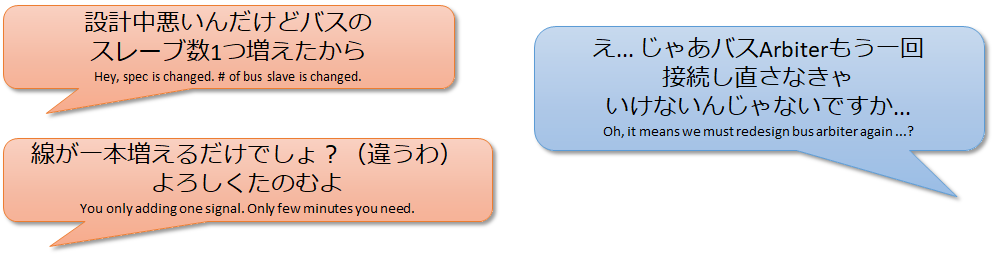


# An example of how to use Chisel: <span style="color:red">Diplomacy</span>

- Parameter Negotiation Framework for generating parameterized protocol implementation.

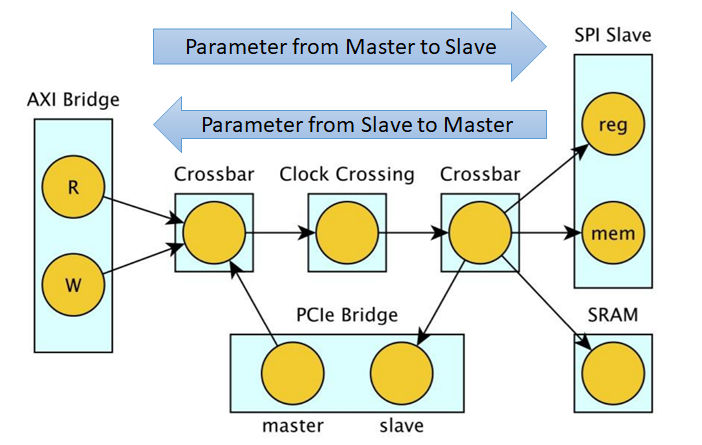


# Where did Diplomacy come from?

- Andrew Waterman's PhD Thesis
  - Design of the RISC-V Instruction Set Architecture
  - https://people.eecs.berkeley.edu/~krste/papers/EECS-2016-1.pdf
- Yunsup Lee's PhD Thesis
  - Decoupled Vector-Fetch Architecture with a Scalarizing Compiler
  - https://people.eecs.berkeley.edu/~krste/papers/EECS-2016-117.pdf
- Henry Cook's PhD Thesis
  - <span style="color:red">Productive Design of Extensible On-Chip Memory Hierarchies</span>.
  - The basic idea of Diplomacy is described in this paper
  - https://www2.eecs.berkeley.edu/Pubs/TechRpts/2016/EECS-2016-89.pdf

# What we want to achieve with Diplomacy

- Flexible configuration using a single design
- Multiple CPU configurations (RV64 / RV32) from a single design
  - Multiple CPU configurations (RV64 / RV32)
  - Multiple bus and cache configurations
    - Number of cores, bus width, cache size, SoC configuration

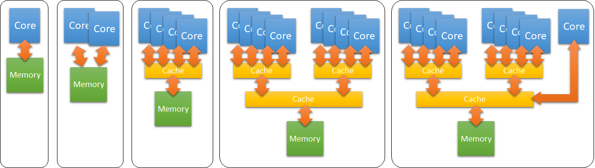

### One example: SiFive's Core IP Generator

- https://scs.sifive.com/core-designer/

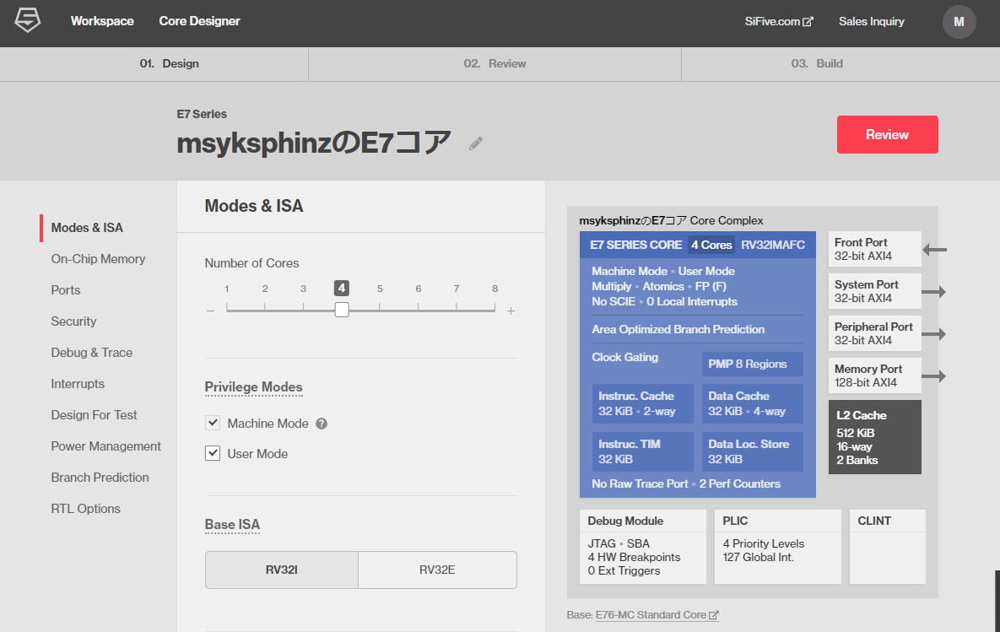


# If you want to develop with Chisel + Diplomacy, use IntelliJ IDEA!

<span style="color:red">Auto Completion feature is mandatory.</span>

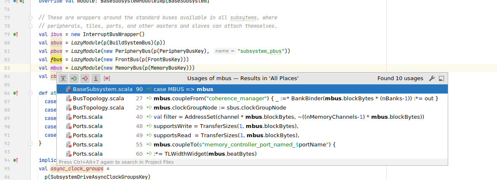


# Misunderstandings: Diplomacy can only be used with TileLink?

No, Diplomacy is a Chisel library, so you don't need to use TileLink to use it.

## Example: Adder for Multiple Inputs connected with Diplomacy

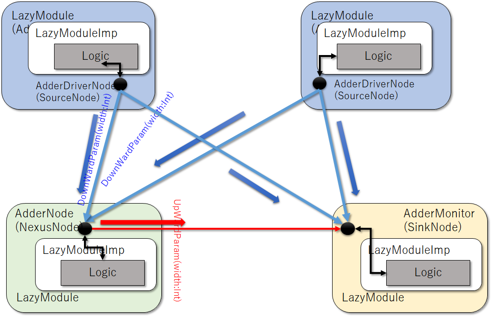

Here are the three modules that we need to decipher

- `AdderDriver` : A driver to send random values to the adder.
- `AdderNode` : The adder itself, to which two or more `AdderDrivers` are connected to add all their values together and output the result.
- `AdderMonitor` : A monitor. Monitor` : A monitor that checks the values sent out by the `AdderDriver` against the results of addition generated by the `AdderNode`.

### AdderDriver.

Driver to send random values to the adder. Key points for reading and understanding `AdderDriver`: 1.

1. <span style="color:red">What is `val node = new AdderDriverNode`? </span>.
2. what is <span style="color:red">`new LazyModuleImp(this)`? </span> 3.

```scala
// class ModuleName extends LazyModule If you think of it as a module for connecting via Diplomacy.
class AdderDriver(width: Int, numOutputs: Int)(implicit p: Parameters) extends LazyModule {
    // 1. what is AdderDriverNode and what is the role of "node" in the first place?
    val node = new AdderDriverNode(Seq.fill(numOutputs)(DownwardParam(width)))

    // 2. What is LazyModuleImp() and what role does it have in Diplomacy?
    lazy val module = new LazyModuleImp(this) {
		...
        // drive signals
    	node.out.foreach { case (addend, _) => addend := randomAddend }
  	}
}

// AdderDriverNode is created by inheriting from the SourceNode class
class AdderDriverNode(widths: Seq[DownwardParam])(implicit valName: ValName)
  extends SourceNode(AdderNodeImp)(widths)
```

- `SourceNode` is used for the node that will be the master.
- `SinkNode` is used for nodes that are slaves.
- `AdapterNode` connects multiple masters and multiple slaves. The number of masters and slaves should be the same.
- `NexusNode` is used to connect multiple masters and multiple slaves. The number of masters and slaves does not have to be the same.

#### 1. node : for connecting between modules

`node` is a communication port for communication between modules in Diplomacy. It has the role of exchanging various parameters between `nodes` and mediating the parameters.

There are two important elements in `node`.

- `bundle` : Contains the I/O ports connected by Diplomacy. In this case, it just contains a bundle of signals for sending random values.

- `edge` : Contains a set of parameters for connecting nodes of Diplomacy. These parameters are communicated between the nodes to make the final inter-node parameter adjustment (Diplomacy).

```scala
object AdderNodeImp extends SimpleNodeImp[DownwardParam, UpwardParam, EdgeParam, UInt] {
  // Edge : Contains a set of parameters for connecting Diplomacy nodes.
  def edge(pd: DownwardParam, pu: UpwardParam, p: Parameters, sourceInfo: SourceInfo) = {
    if (pd.width < pu.width) EdgeParam(pd.width) else EdgeParam(pu.width)
  }

  // Contains the I/O ports connected by Diplomacy.
  // UInt(e.width.W) : e is the EdgeParam, i.e. the edge parameter
  def bundle(e: EdgeParam) = UInt(e.width.W)

  def render(e: EdgeParam) = RenderedEdge("blue", s "width = ${e.width}")
}
```

#### 2. `LazyModuleImp` : The part that implements the circuit based on the information of node.

2. `LazyModuleImp` : The part that implements the circuit based on the information of `node`.

```scala
  val node = new AdderDriverNode(Seq.fill(numOutputs)(DownwardParam(width)))

  lazy val module = new LazyModuleImp(this) {
    // Extract bit width information from all node edges
    val negotiatedWidths = node.edges.out.map(_.width)
    // Do all inter-node connection lines have the same number of bits?
    require(negotiatedWidths.forall(_ == negotiatedWidths.head), "outputs must all have agreed on same width")

    // Use the head node's information if it is available (well, it doesn't matter which node's information is used)
    val finalWidth = negotiatedWidths.head

    // generate random numbers by FibonacciLFSR module
    val randomAddend = FibonacciLFSR.maxPeriod(finalWidth)

    // send random numbers to all output nodes
    node.out.foreach { case (addend, _) => addend := randomAddend }
  }
```

### If you use Diplomacy, use yEd to check the node graph diagram!

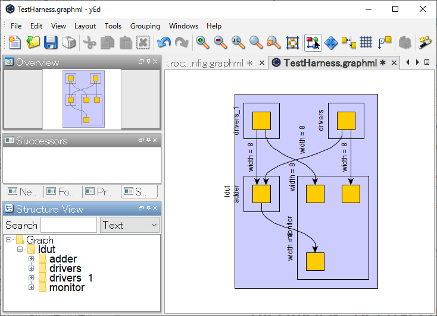

<div align="center">Figure. Diagram of the Adder graph generated by yEd.</div>

- A more complex example: Node connection diagram for a 4-core configuration in Freedom-SoC.

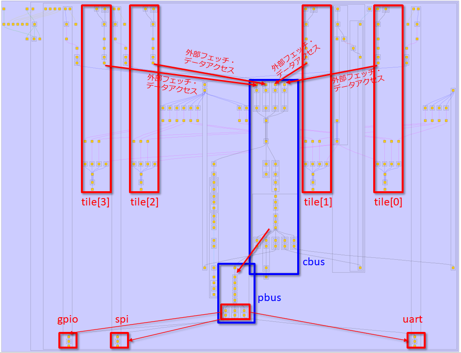

<div align="center">Figure. Connection diagram of freedom SoC nodes</div>

# Home-made CPU using TileLink + various bus connections

### Try to make your own CPU.

- I made my own CPU using Chisel, and connected it to TileLink to make a simple multi-core system.

#### CPU core I made: RV64 with simple 5-stage pipeline.

I made a CPU core that can run `riscv-tests` for now, though I haven't tested it properly.

https://github.com/msyksphinz-self/chisel-soc/tree/main/src/main/scala/core


- The fetch bus / data bus is very simple (non-TileLink / non-AXI bus)

https://github.com/msyksphinz-self/chisel-soc/blob/main/src/main/scala/core/cpu_bus.scala#L17 (link to `InstBus`)

https://github.com/msyksphinz-self/chisel-soc/blob/main/src/main/scala/core/cpu_bus.scala#L30 (link to `DataBus`)

### How do I integrate my homebrew CPU into TileLink to build a SoC?

1. wrap your own CPU with LazyModule. 2.
2. define a node of `TileLink`. 3.
3. connect the node of TileLink to the node of your CPU.

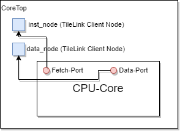

<div align="center">Figure. Interface configuration of home-made CPU</div>

- There are two TileLink nodes available.
  - For instruction fetching
  - For data access
- Both of them are TileLink, but I was forced to replace them because my own CPU has its own bus protocol.
  - Now, the `CoreTop` module is replaced with a module that has two TileLink interfaces.

```scala
	// Pull the ClientNode of the instruction/data bus defined in TileLink into the internal
	val (inst_out, inst_edge) = inst_node.out(0)
    val (data_out, data_edge) = data_node.out(0)
    val baseEnd = 0
    val (sizeEnd, sizeOff) = (inst_edge.bundle.sizeBits + baseEnd, baseEnd)
    val (sourceEnd, sourceOff) = (inst_edge.bundle.sourceBits + sizeEnd, sizeEnd)
    val beatBytes = inst_edge.bundle.dataBits

	// Define the instance of your own CPU
    val cpu = Module(new Cpu(conf, hartid))

	// Connect TileLink's fetch port signal to the fetch port of the home-made CPU (proprietary protocol)
	inst_out.a.valid := cpu.io.inst_bus.req
    inst_out.a.bits.address := cpu.io.inst_bus.addr
    inst_out.a.bits.opcode := TLMessages.Get
	...
	cpu.io.inst_bus.ready := inst_out.a.ready
    cpu.io.inst_bus.ack := inst_out.d.valid
    cpu.io.inst_bus.rddata := inst_out.d.bits.data.asSInt

	// Connect TileLink's data access port signal to the data access port (proprietary protocol) of the home-made CPU
    data_out.a.valid := cpu.io.data_bus.req
    data_out.a.bits.address := cpu.io.data_bus.addr
    data_out.a.bits.opcode := TLMessages.Get
	...
	cpu.io.data_bus.ack := data_out.d.valid
    cpu.io.data_bus.rddata := data_out.d.bits.data.asSInt
```

### Create a SoC using CoreTop with TileLink module.

Create a `CoreTop` and a `CoreComplex` module with a memory module and connect them.

```scala
class core_complex[Conf <: RVConfig]
  (conf: Conf, numCores: Int, ramBeatBytes: Int, txns: Int)(implicit p: Parameters)
  extends LazyModule {
  // Data loader for data access to memory from outside.
  val loader = LazyModule(new loader("loader"))

  // CPU cores (instantiate multiple for numCore)
  val core   = Seq.tabulate(numCores) { case i => LazyModule(new CoreTop(conf, i, "core" + i.toString)) }
  // TileLink crossbar
  val xbar   = LazyModule(new TLXbar)
  // memory with TileLink interface
  val memory = LazyModule(new TLRAM(AddressSet(0x80000000L, 0x0ffff), beatBytes = ramBeatBytes))

  // Connect the instruction fetch port and data port of the CPU core to the crossbar
  xbar.node := loader.node
  core.foreach { case (core) => {
    //
    xbar.node := TLDelayer(0.1) := core.inst_node
    xbar.node := TLDelayer(0.1) := core.data_node
  }
  }
  // Connect the data loader to the crossbar
  memory.node := xbar.node

```


<div align="center">Figure. Connecting a home-made CPU to memory through TileLink to configure a simple SoC.</div>

### Set `numCores` to >1 for easy multi-core configuration.

With the above description of Chisel, you can easily make it multi-core. Just set `nCores` to 2, 3, ... to `nCores`, and multiple CPUs will be connected to the crossbar automatically.


<div align="center">Figure. Connecting a home-made CPU to memory through TileLink. When connection=4</div>

- A simple simulation example. At first, the memory access is well arbitrated even when 4 cores request at the same time.

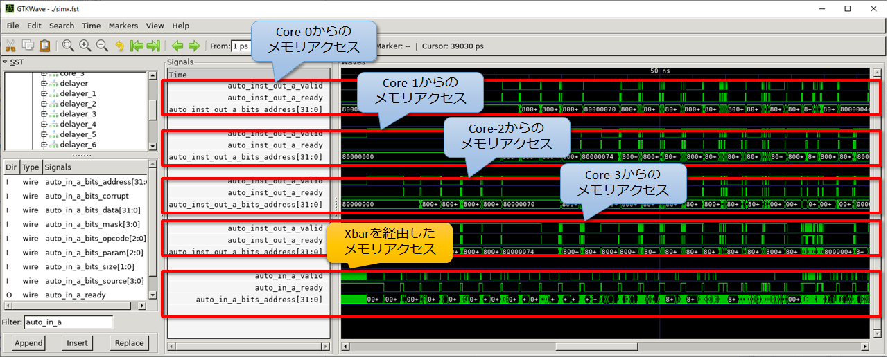

<div align="center">Figure . RTL simulation in a four-core configuration.</div>

- Example of Diplomacy node configuration with 4-core configuration

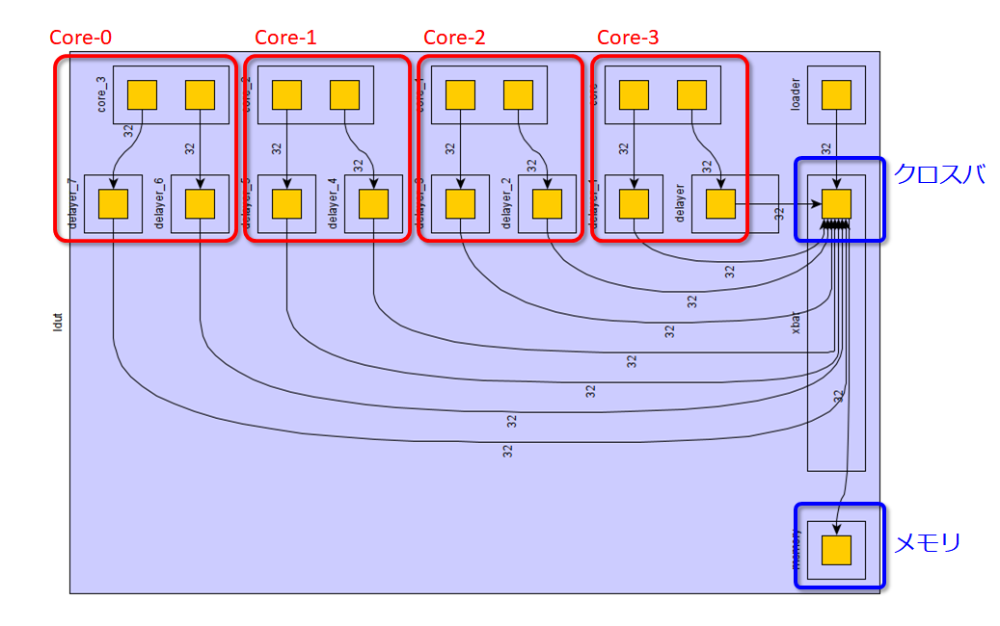

<div align="center">Figure. Diplomacy connection diagram for a four-core configuration.</div>


# Let's learn how to connect the bus using RocketTile as an example.

- Typical CPU implementation of RISC-V: Rocket-Chip https://github.com/chipsalliance/rocket-chip

### Rocket-Chip Generator: Do you know why it's named "Generator"?

- Rocket-Chip is a comprehensive package that includes not only the design, but also Diplomacy for coordination between designs, Chisel implementation, and FIRRTL implementation itself.
- It is called "Generator" because it includes not only the Scala implementation but also all the engines to generate the hardware.

## Let's look at the Diplomacy configuration of `DefaultConfig` of Rocket-Chip.

The bus connection of Rocket-Chip is basically configured using TileLink and Diplomacy.

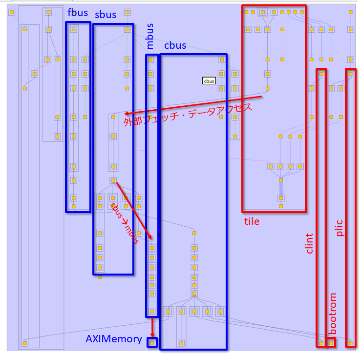

Let's break down little more.

Let's take a look at the bus connections.

## Connect devices using Diplomacy with RocketTile

- RocketTile : One basic CPU core element that contains all the basic components such as RocketChip and DCache.
  - In CPU vendors, it is also called "CoreComplex"... Why do they call it "Core Complex"? I'm not sure.

### (Simple) memory map by Rocket-Chip.

| Start Address | Stop Address | Attributes | Explanation             |
| ------------- | ------------ | ---------- | ----------------------- |
| 0x0000_0000   | 0x0000_1000  | ARWX       | debug-controller@0      |
| 0x0000_3000   | 0x0000_4000  | ARWX       | error-device@3000       |
| 0x0001_0000   | 0x0002_0000  | RX         | rom@10000               |
| 0x0200_0000   | 0x0200_1000  | ARW        | clint@2000000           |
| 0x0c00_0000   | 0x1000_0000  | ARW        | interrupt_controller    |
| 0x6000_0000   | 0x8000_0000  | RWX        | mmio-port-axi4@60000000 |
| 0x8000_0000   | 0x9000_0000  | RWXC       | memory@8000_0000        |


## Verilog structure of RocketTile

```verilog
module RocketTile( // @[:freechips.rocketchip.system.DefaultConfig.fir@200426.2]

  TLXbar_8 tlMasterXbar ();

  IntXbar_4 intXbar ();

  DCache dcache ();

  Frontend frontend ();

  TLBuffer_9 buffer ();

  IntSyncCrossingSink intsink ();

  IntSyncCrossingSink_1 intsink_1 ();

  IntSyncCrossingSink_2 intsink_2 ();

  IntSyncCrossingSink_2 intsink_3 ();

  FPU fpuOpt ();

  HellaCacheArbiter dcacheArb ();

  PTW ptw ();

  Rocket core ();
```

I made a diagram by extracting the important parts. <span style="color:blue">Blue is LazyModule</span>, <span style="color:red">Red is NormalModule</span>.


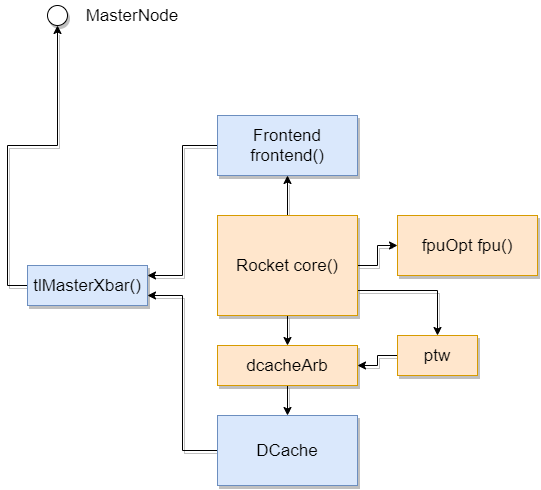

So, how can we decipher this from Scala? Let's take a look at some examples to see how the nodes are connected.

- Let's take a look at `RocketTile.scala`.

```scala
class RocketTile private(
      val rocketParams: RocketTileParams,
      crossing: ClockCrossingType,
      lookup: LookupByHartIdImpl,
      q: Parameters,
      logicalTreeNode: LogicalTreeNode)
    extends BaseTile(rocketParams, crossing, lookup, q)
    with SinksExternalInterrupts
    with SourcesExternalNotifications
    with HasLazyRoCC  // implies CanHaveSharedFPU with CanHavePTW with HasHellaCache
    with HasHellaCache
    with HasICacheFrontend
{
/* ... */
	override lazy val module = new RocketTileModuleImp(this)
/* ... */
}
```

- What is the implementation of `RocketTileModuleImp`?

```scala
// "outer" corresponds to the RocketTile above
class RocketTileModuleImp(outer: RocketTile) extends BaseTileModuleImp(outer)
    with HasFpuOpt
    with HasLazyRoCCModule
    with HasICacheFrontendModule {
/* ... */
  val core = Module(new Rocket(outer)(outer.p))
/* ... */
  outer.frontend.module.io.cpu <> core.io.imem
  dcachePorts += core.io.dmem // TODO outer.dcachePorts += () => module.core.io.dmem ??

  /* For FPU, depending on options, connect */
  fpuOpt foreach { fpu => core.io.fpu <> fpu.io }

  /* Connect DCache to the data cache arbiter */
  dcacheArb.io.requestor <> dcachePorts
  ptw.io.requestor <> ptwPorts

```

- FPU Connection  (we are not using Diplomacy here)


- DCache Connection

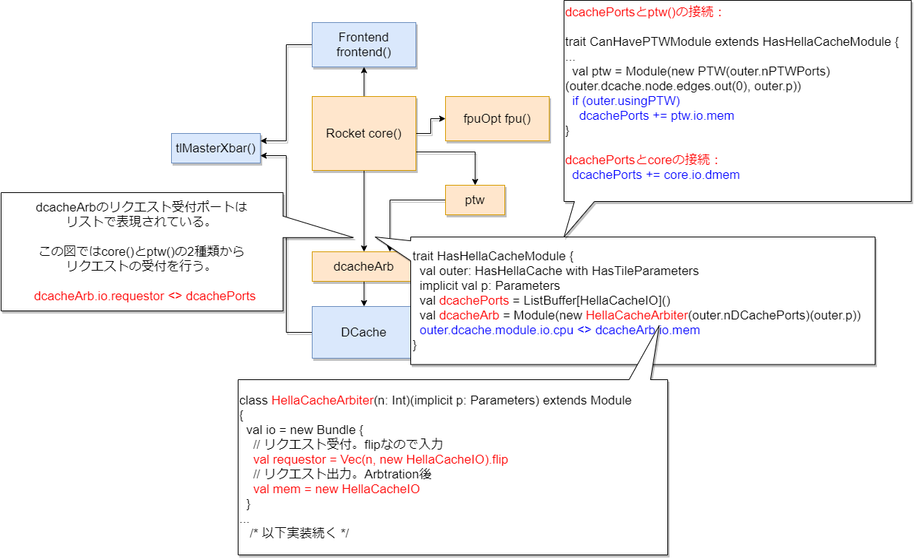


## Let's read and understand the configuration of the SoC part of Rocket-Chip.

- When Verilog is generated by Rocket-Chip Generator, a top module called `TestHarness` is generated, which is a module for test execution.
  - This is also all generated from Chisel without the help of Verilog.

- `src/main/scala/system/TestHarness.scala`

```scala
class TestHarness()(implicit p: Parameters) extends Module {
  val io = new Bundle {
    val success = Bool(OUTPUT)
  }

  val ldut = LazyModule(new ExampleRocketSystem) // Instantiate ExampleRocketSystem.
  val dut = Module(ldut.module) // ExmapleRocketSystem is a LazyModule, so extract the entity inside it as dut.

  dut.dontTouchPorts()
  dut.tieOffInterrupts()
  SimAXIMem.connectMem(ldut) // instantiate the object SimAXIMem and connect the memory port of ldut
  SimAXIMem.connectMMIO(ldut) // object Instantiate SimAXIMem and connect ldut's MMIO port
  ldut.l2_frontend_bus_axi4.foreach(_.tioff) // ldut's frontend port should be Tie Zero
```

- `SimAXIMem.connectMem(ldut)`の部分を除いてみる

```scala
  def connectMem(dut: CanHaveMasterAXI4MemPort)(implicit p: Parameters): Seq[SimAXIMem] = {
    // mem_axi4 in ExampleRocketSystem shows the io port
    // dut.memAXI4Node.in is the SlavePort node of the LazyModule
    dut.mem_axi4.zip(dut.memAXI4Node.in).map { case (io, (_, edge)) =>
      // Newly instantiate AXI4 memory
      // The size of the memory depends on the edge information of the AXI node
      val mem = LazyModule(new SimAXIMem(edge, size = p(ExtMem).get.master.size))
      Module(mem.module).suggestName("mem")
      // Connect the I/O port of the memory instance to the AXI port of the ldut
      mem.io_axi4.head <> io
      mem
    }
  }
```

- AXI4メモリポートの仕組み (`src/main/scala/subsystem/Ports.scala`)

```scala
/** Adds a port to the system intended to master an AXI4 DRAM controller. */
trait CanHaveMasterAXI4MemPort { this: BaseSubsystem =>
  private val memPortParamsOpt = p(ExtMem)
  private val portName = "axi4"
  private val device = new MemoryDevice
  private val idBits = memPortParamsOpt.map(_.master.idBits).getOrElse(1)
  // Create a Diplomacy slave node for AXI4.
  // The reason why it is a slave is because the internal TileLink (master) is the master and the AXI4 node is the slave.
  val memAXI4Node = AXI4SlaveNode(memPortParamsOpt.map({ case MemoryPortParams(memPortParams, nMemoryChannels) =>
    Seq.tabulate(nMemoryChannels) { channel =>
      val base = AddressSet.misaligned(memPortParams.base, memPortParams.size)
      val filter = AddressSet(channel * mbus.blockBytes, ~((nMemoryChannels-1) * mbus.blockBytes))
...
  // Connect the node to the mbus (memory bus).
  mbus.coupleTo(s"memory_controller_port_named_$portName") {
    (memAXI4Node 						// AXI memory node
      :*= AXI4UserYanker() 				// ↑ Add a User field to the AXI4 protocol
      :*= AXI4IdIndexer(idBits) 		// ↑ Extend the ID bits of AXI4
      :*= TLToAXI4() 					// ↑ Change the protocol to AXI4
      :*= TLWidthWidget(mbus.beatBytes) // ↑ Change bus width of mbus(TileLink)
      :*= _) 							//  this means mbus
  }

  val mem_axi4 = InModuleBody { memAXI4Node.makeIOs() }
}
```

- Note : Why is the MMIO connected to the memory? This is a test environment, so the memory is automatically connected.

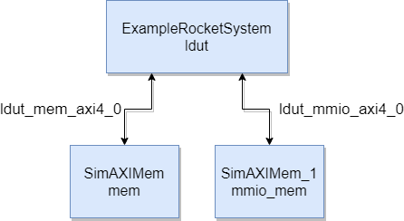


## How to create a configurable module using Config / Parameter.

## <span style="color:blue">Motivation: Why does Rocket-Chip have so many variations of Verilog that can be generated? </span>

```sh
$ make CONFIG=DefaultConfig 		# Generate RV64GC configuration.
$ make CONFIG=RV32Config			# generate RV32GC configuration
$ make CONFIG=DualCoreConfig 		# Generate SoC with 2-core configuration.
$ make CONFIG=RoCCExampleConfig 	# Generate a configuration with RoCC (Rocket Custom Coprocessor).
```

### Because each function is divided while maintaining Modularity.

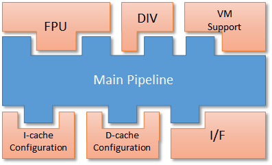

<div align="center">Figure. In the Rocket-Chip + SoC configuration, each module is designed to be highly independent.</div>

- `src/main/scala/system/Configs.scala`

```scala
class BaseConfig extends Config(
  new WithDefaultMemPort() ++
  new WithDefaultMMIOPort() ++
  new WithDefaultSlavePort() ++
  new WithTimebase(BigInt(1000000)) ++ // 1 MHz
  new WithDTS("freechips,rocketchip-unknown", Nil) ++
  new WithNExtTopInterrupts(2) ++
  new BaseSubsystemConfig()
)

class DefaultConfig extends Config(new WithNBigCores(1) ++ new WithCoherentBusTopology ++ new BaseConfig)
 
class DefaultBufferlessConfig extends Config(new WithBufferlessBroadcastHub ++ new DefaultConfig)
class DefaultSmallConfig extends Config(new WithNSmallCores(1) ++ new WithCoherentBusTopology ++ new BaseConfig)
class DefaultRV32Config extends Config(new WithRV32 ++ new DefaultConfig)
 
class DualBankConfig extends Config(new WithNBanks(2) ++ new DefaultConfig)
class DualCoreConfig extends Config(new WithNBigCores(2) ++ new WithCoherentBusTopology ++ new BaseConfig)
class DualChannelConfig extends Config(new WithNMemoryChannels(2) ++ new DefaultConfig)
class EightChannelConfig extends Config(new WithNMemoryChannels(8) ++ new DefaultConfig)
 
class DualChannelDualBankConfig extends Config(
  new WithNMemoryChannels(2) ++
  new WithNBanks(4) ++ new DefaultConfig)
 
class RoccExampleConfig extends Config(new WithRoccExample ++ new DefaultConfig)
```

What does the above `class DualBankConfig extends Config(new WithNBanks(2) ++ new DefaultConfig)` mean? See about `Config` and `Parameter`.

## Some techniques for passing parameters: Config

### Concept of Config: build a reference table (map function) of "<span style="color:blue">apply this parameter to this module</span>".

### ⇔ Verilog: "<span style="color:red">Put parameters down from the top / centralized management by package</span>".

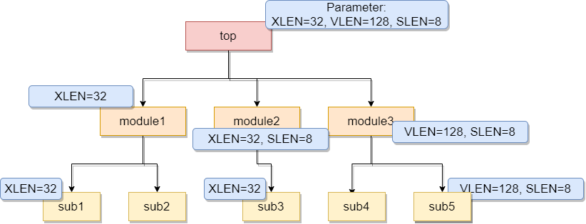

<div align="center">図. Verilogのパラメータを階層で降ろしていく（なんとなくの）イメージ</div>

#### In the case of Chisel's Config: Create a dictionary of keys and get parameters from the keys you need in the module.

```sh
$ grep -h -R Key | grep Field
```

```scala
case object APBDebugRegistersKey extends Field[Map[Int, Seq[RegField]]](Map())
case object DebugModuleKey extends Field[Option[DebugModuleParams]](Some(DebugModuleParams()))
case object DebugModuleHartSelKey extends Field(DebugModuleHartSelFuncs())
case object JtagDTMKey extends Field[JtagDTMConfig](new JtagDTMKeyDefault())
case object CLINTKey extends Field[Option[CLINTParams]](None)
...
case object SubsystemDriveAsyncClockGroupsKey extends Field[Option[ClockGroupDriverParameters]](Some(ClockGroupDriverParameters(1)))
case object AsyncClockGroupsKey extends Field[ClockGroupEphemeralNode](ClockGroupEphemeralNode()(ValName("async_clock_groups")))
case object BroadcastKey extends Field(BroadcastParams())
case object RocketTilesKey extends Field[Seq[RocketTileParams]](Nil)
case object RocketCrossingKey extends Field[Seq[RocketCrossingParams]](List(RocketCrossingParams()))
case object PeripheryMaskROMKey extends Field[Seq[MaskROMParams]](Nil)
...
case object PSDTestModeBroadcastKey extends Field(
```

You can think of it as being like making a dictionary:.

| Key                    |      | Type                      | Explain                                                      |
| ---------------------- | ---- | ------------------------- | ------------------------------------------------------------ |
| `APBDebugRegistersKey` | →    | `Map[Int, Seq[RegField]]` |                                                              |
| `RocketTilesKey`       | →    | `Seq[RocketTileParams]]`  | Why are they enclosed in `Seq` -> <br />RocketTiles are placed in multiple locations in multi-core configurations, so `RocketTileParams` are duplicated for each Tile. |
| `PeripheryMaskROMKey`  | →    | `Seq[MaskROMParams]`      |                                                              |

For example, `RocketTileParams` is defined as follows: `RocketTileParams` is just like `package` in System Verilog?

```scala
case class RocketCoreParams(
  bootFreqHz: BigInt = 0,
  useVM: Boolean = true,
  useUser: Boolean = false,
  useDebug: Boolean = true,
...
```

Now let's go back to the definition of `DualCoreConfig` again...

- `DualCoreConfig` inherits from the `Config` class. You can think of the `Config` class as a set of dictionary table conversion functions based on the View. These sets of dictionary table conversion functions are finally aggregated as `Parameter` and passed to the design.

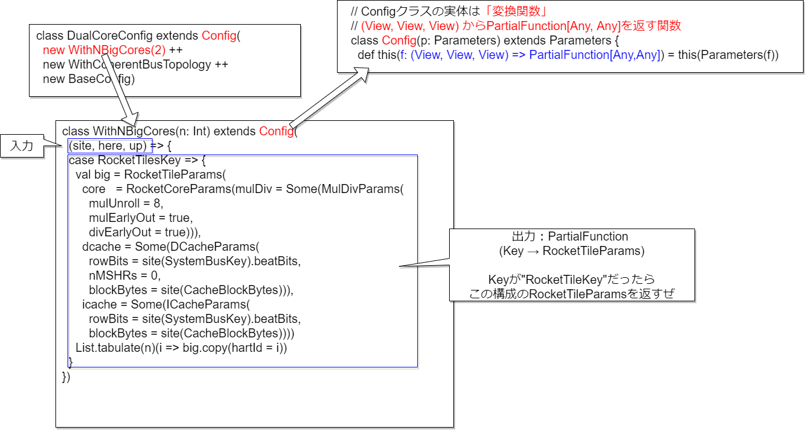

In each module, call the parameters defined here to get the concrete values.

- `src/main/scala/rocket/RocketCore.scala`

```scala
trait HasRocketCoreParameters extends HasCoreParameters {
  lazy val rocketParams: RocketCoreParams = tileParams.core.asInstanceOf[RocketCoreParams]

  val fastLoadWord = rocketParams.fastLoadWord
  val fastLoadByte = rocketParams.fastLoadByte

  val mulDivParams = rocketParams.mulDiv.getOrElse(MulDivParams()) // TODO ask andrew about this

  require(!fastLoadByte || fastLoadWord)
}
```

```scala
@chiselName
class Rocket(tile: RocketTile)(implicit p: Parameters) extends CoreModule()(p)
    with HasRocketCoreParameters
    with HasCoreIO {

  val clock_en_reg = RegInit(true.B)
...
  // multiplier and divider
  val div = Module(new MulDiv(if (pipelinedMul) mulDivParams.copy(mulUnroll = 0) else mulDivParams, width = xLen))
  div.io.req.valid := ex_reg_valid && ex_ctrl.div
  div.io.req.bits.dw := ex_ctrl.alu_dw
  div.io.req.bits.fn := ex_ctrl.alu_fn
...
```


- `src/main/scala/rocket/Multiplier.scala`

```scala
class MulDiv(cfg: MulDivParams, width: Int, nXpr: Int = 32) extends Module {
  private def minDivLatency = (cfg.divUnroll > 0).option(if (cfg.divEarlyOut) 3 else 1 + w/cfg.divUnroll)
  private def minMulLatency = (cfg.mulUnroll > 0).option(if (cfg.mulEarlyOut) 2 else w/cfg.mulUnroll)
  def minLatency: Int = (minDivLatency ++ minMulLatency).min

  val io = IO(new MultiplierIO(width, log2Up(nXpr)))
...
  val req = Reg(chiselTypeOf(io.req.bits))
  val count = Reg(UInt(log2Ceil(
    ((cfg.divUnroll != 0).option(w/cfg.divUnroll + 1).toSeq ++
     (cfg.mulUnroll != 0).option(mulw/cfg.mulUnroll)).reduce(_ max _)).W))

```

### How to use `here()`, `site()`, `up()`, etc.

- If you want to use the value of another parameter to calculate a parameter used in `Config`, you can do the following in Verilog.

```verilog
localparam param1 = 100;
localparam param2 = param1 * 100;
```

If you try to achieve this in Chisel, it will look like this. The `BusWidthBytes` parameter is used to calculate the address size.

```scala
class Bus128BitConfig extends Config((site, here, up) => {
  case BusWidthBytes => 128 / 8
  // BusWidthBytes is a case class, so it is not an integer
  case AddrSize => 0x100 * BusWidthBytes
})

class Bus64BitConfig extends Config((site, here, up) => {
  case BusWidthBytes => 64 / 8
  // BusWidthBytes is a case class, so it is not an integer
  case AddrSize => 0x200 * BusWidthBytes
})

[error] /home/msyksphinz/work/riscv/chisel-development/minimal-diplomacy/src/main/scala/core_complex/Configs.scala:11:26: overloaded method value * with alternatives:
[error]   (x: Double)Double <and>
[error]   (x: Float)Float <and>
[error]   (x: Long)Long <and>
[error]   (x: Int)Int <and>
[error]   (x: Char)Int <and>
[error]   (x: Short)Int <and>
[error]   (x: Byte)Int
[error]  cannot be applied to (core_complex.BusWidthBytes.type)
[error]   case AddrSize => 0x100 * BusWidthBytes  // <-- BusWidthBytes is not a number!
[error]                          ^
```

As you can see, `BusWidthBytes` itself is a case class, so you can't use it directly as a value. So, we use information such as `here()` to refer to a value in the same `Config` for dictionary search.

```scala
class Bus128BitConfig extends Config((site, here, up) => {
  case BusWidthBytes => 128 / 8
  case AddrSize => 0x100 * here(BusWidthBytes)
})

class Bus64BitConfig extends Config((site, here, up) => {
  case BusWidthBytes => 64 / 8
  case AddrSize => 0x200 * here(BusWidthBytes)
})
// Bus128BitConfigで構成したTLRAM, 12ビットのバス幅で構成される
module TLRAM(
  input         clock,
  input         reset,
  input         auto_in_a_valid,
  input  [2:0]  auto_in_a_bits_opcode,
  input  [11:0] auto_in_a_bits_address,
  input  [31:0] auto_in_a_bits_data,
  output        auto_in_d_valid,
  output [2:0]  auto_in_d_bits_opcode,
  output [31:0] auto_in_d_bits_data
);
```

一方で、`site()`を使用するとより上位のConfigを使用するようになる。例えば`Default2Config`では以下のように構成している。

- `sites()`を使用するケース：`Bus128BitConfig`で`site()`を使用すると`BaseConfig`を参照する。つまり`AddrSize`は`0x100 * (256/8)`になるはずだ。

```scala
class Default2Config extends Config(
  new BaseConfig ++
  new Bus128BitConfig ++ new IfuNotConnectConfig
)
class BaseConfig extends Config((site, here, up) => {
  case BusWidthBytes => 256 / 8
})

class Bus128BitConfig extends Config((site, here, up) => {
  case BusWidthBytes => 128 / 8
  case AddrSize => 0x100 * here(BusWidthBytes)
})
// TLRAM configured with Bus128BitConfig, with a 12-bit bus width
module TLRAM(
  input          clock,
  input          reset,
  input          auto_in_a_valid,
  input  [2:0]   auto_in_a_bits_opcode,
  input  [12:0]  auto_in_a_bits_address,
  input  [255:0] auto_in_a_bits_data,
  output         auto_in_d_valid,
  output [2:0]   auto_in_d_bits_opcode,
  output [255:0] auto_in_d_bits_data
);
```

- The case of using `up()`: In the following, two modules, `Adder()` and `Mul()`, are defined. The number of input/output bits is defined by `p(BitWidth)`. We consider the problem of what to do if we want to define completely different bit widths for `Adder()` and `Mul()`.

```scala
class Adder()(implicit p: Parameters) extends Module {
  val bitwidth = p(BitWidth)
  val io = IO(new Bundle{
    val a = Input(SInt(bitwidth.W))
    val b = Input(SInt(bitwidth.W))
    val c = Output(SInt(bitwidth.W))
  })

  io.c := io.a + io.b
}

class Mul()(implicit p: Parameters) extends Module {
  val bitwidth = p(BitWidth)
  val io = IO(new Bundle{
    val a = Input(SInt(bitwidth.W))
    val b = Input(SInt(bitwidth.W))
    val c = Output(SInt((bitwidth * 2).W))
  })

  io.c := io.a * io.b
}
```

At this time, the parameters of `Adder()` and `Mul()` are defined as follows. `Adder()` is assumed to be instantiated with 64 bits, and `Mul()` with 128 bits input bit width.

```scala
case object AdderBitWidth extends Field[Int]
case object MulBitWidth extends Field[Int]

class DefaultConfig() extends Config((site, here, up) => {
  case AdderBitWidth => 64
  case MulBitWidth => 128
})
```

We override the parameters of `Adder()` and `Mul()` when we instantiate them, but we have to define and pass `adder_param` and `mul_param` anew.

```scala
  val Adder_mod = Module(new Adder()(adder_params))
  Adder_mod.io.a := io.a
  Adder_mod.io.b := io.b
  io.Adder_c := Adder_mod.io.c

  val mul_mod = Module(new Mul()(mul_params))
  mul_mod.io.a := io.a
  mul_mod.io.b := io.b
  io.mul_c := mul_mod.io.c
```

Here, `adder_params` is inherited from the above `DefaultConfig`, while the `BitWidth` parameter is inherited from the parameter used in the previous `DefaultConfig`. Use `up()` at this time. This will create:

```scala
  val adder_params = p.alter((site, here, up) => {
    case BitWidth => up(AdderBitWidth)
  })

  val mul_params = p.alter((site, here, up) => {
    case BitWidth => up(MulBitWidth)
  })
```

The `BitWidth` of `adder_params` will inherit the `AdderBitWidth` of `DefaultConfig`, and the `BitWidth` of `mul_params` will inherit the `MulBitWidth` of `DefaultConfig`. This makes it possible to inherit different parameters for the same `BitWidth` parameter.

The results are as follows: the input bit width of `Adder` is 64 bits, inherited from `AddrBitWidth`, and the input bit width of `Mul` is 128 bits, inherited from `MulBitWidth`.

```verilog
module Adder(
  input  [63:0] io_a,
  input  [63:0] io_b,
  output [63:0] io_c
);
  assign io_c = $signed(io_a) + $signed(io_b); // @[up_example.scala 48:8]
endmodule
module Mul(
  input  [127:0] io_a,
  input  [127:0] io_b,
  output [255:0] io_c
);
  assign io_c = $signed(io_a) * $signed(io_b); // @[up_example.scala 59:8]
endmodule
```

# Summary

- Chisel usage points → Network part, not in the core. The part where flexibility is required.
- Using Diplomacy to connect to the bus network of your own CPU
- The bus part of Rocket-Chip is built with a lot of Diplomacy bus configuration.
- More flexible parameterization with `Config`/`Parameter`.
