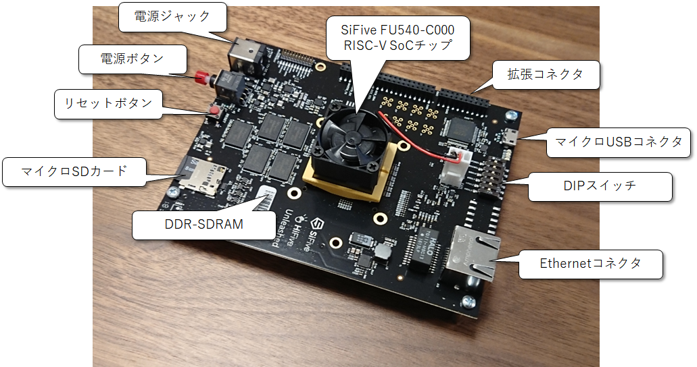
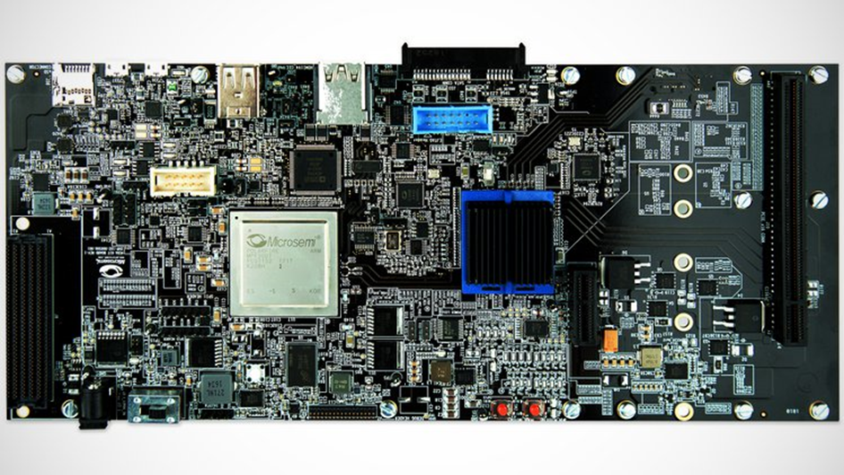
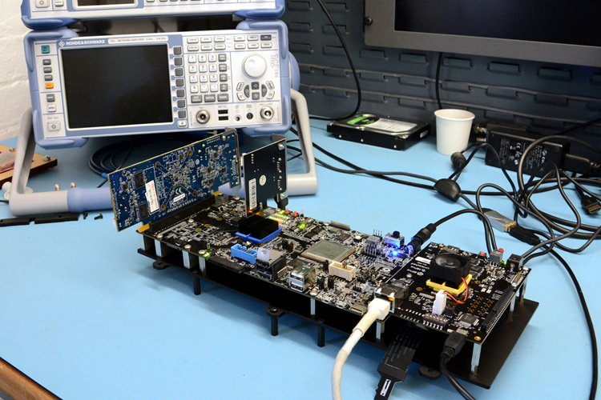
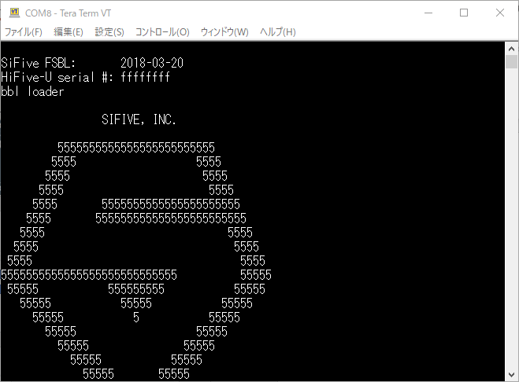
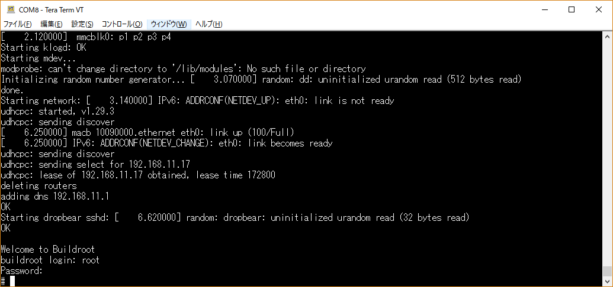
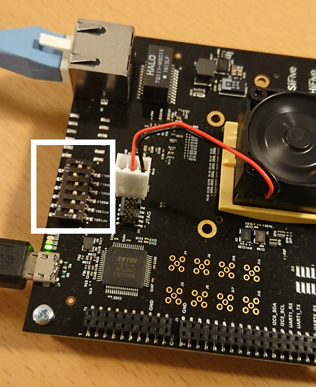
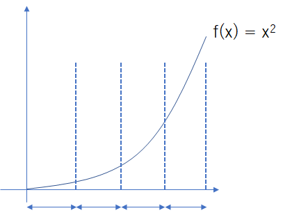
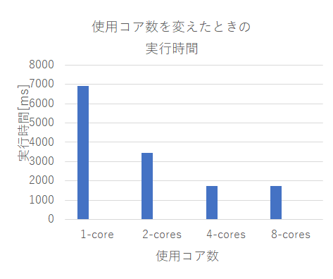
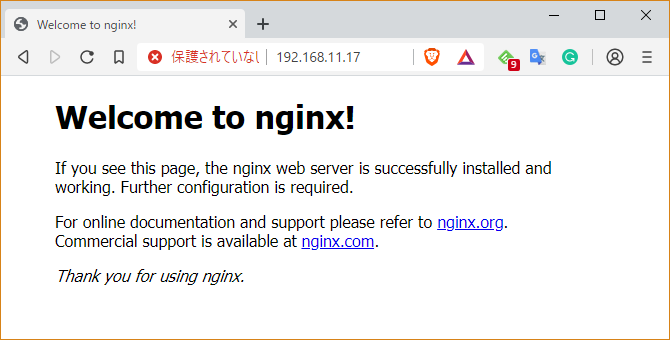

# 【供養】 CQ出版インターフェース2019年オープンソースRISC-V特集時にボツとなったHiFive Unleashed特集原稿

## SiFive社のマルチコア本格RISC-Vボード HiFive Unleashedを使ってみる

RISC-Vの評価ボードは、数は少ないですが様々なものがリリースされています。中でも、RISC-VプロセッサのIP開発を手掛けるSiFive社は、個人でも購入できるRISC-V評価ボードを提供しています。

その中で、2018年の2月にCrowd Supplyというクラウドファンディングで発表された"HiFive Unleashed"という評価ボードは、本格的なマルチコアのRISC-Vボードとして大注目の評価ボードです(図[refs:hifive_unleashed])。



<div align="center">図[refs:hifive_unleashed] SiFive社の販売しているHiFive Unleashed RISC-V開発ボード</div>

基本的な仕様は、以下の通りです。

- 4+1マルチコア構成。最大動作周波数1.5GHz (U54-MCのマニュアルは https://www.sifive.com/documentation/risc-v-core/u54-mc-risc-v-core-ip-manual/ から入手できる)
  - 64ビットRISC-Vコア (RV64GC) x4、 Sv39仮想メモリサポート
  - 64ビットRISC-Vコア (RV64IMAC) マネージメントコア
- 2MB コヒーレント L2キャッシュ
- ECC付き 64-bit DDR4
- 1x ギガビット Ethernet
- 28nm プロセスにて製造

ボード全体の構成としては、

- SiFive U540 SoC (U540の正式な仕様書はまだ存在していない。 U500の仕様書は[こちら](https://www.sifive.com/documentation/freedom-soc/freedom-u500-platform-brief/)から入手できる)
- ECC付き 8GB DDR4-SDRAM
- ギガビット Ethernet ポート
- 32MB Quad SPI フラッシュメモリ
- MicroSDカードストレージ
- アドインカード接続用のFMCコネクタ

と、かなり本格的です。実際 Linuxもブートすることができ、様々なベンチマークプログラムを動かしたり、はてはデスクトップPCとして使う事例もある、非常に面白い、将来性のあるボードです。

### 拡張ボードでさらに本格的な評価ボードへ変身

HiFive Unleashedには拡張ボードが提供されています(図[refs:unleashed_expansion_board])。拡張ボードはMicorsemiのFPGAが搭載されておりさらに多くの外部I/Oが使用できるようになっています。



<div align="center">図[refs:unleashed_expansion_board] HiFive Unleashed Expansion Board. 写真は https://www.crowdsupply.com/microsemi/hifive-unleashed-expansion-board より抜粋。</div>

https://www.crowdsupply.com/microsemi/hifive-unleashed-expansion-board

お値段は、$1,999と、HiFive Unleashedよりもさらに高いですが、仕事でRISC-Vを評価したい方や、RISC-VでデスクトップPCを構築したいというようなマニアックな用途の場合は無くてはならない存在だと思います。

こちらの拡張ボードには、

- 300Kロジックエレメント相当の Microsemi製のPolarFire FPGA
- 24レーンのPCI Expressスイッチ
- x1 PCI Expressカードコネクタ
- x16 PCI Expressカードコネクタ。4レーンのPCI Express Gen2が接続可能
- SSD M.2コネクタ
- SATAコネクタ
- HDMIコネクタ
- eMMC NAND Flash
- マイクロUSB カードスロット
- USB to UARTブリッジ
- 4Gbit x16 DDR4 SDRAM
- リモートFPGAアップデート用のSPIフラッシュ、GPIOに接続されているQSPIフラッシュ
- CANトランシーバ x2
- FMCコネクタ

と、何でもありなボードです。逆に使いこなし切るのが難しいくらいではないでしょうか。

筆者はこの拡張ボードは持っていないのですが、入手できたら、ぜひとも活用してみたいです。

### HiFive Unleashedを使ってデスクトップPCを作る猛者が現れる

さらにネット上には、このHiFive Unleashedを使ってデスクトップPCに相当する環境を作ってしまった猛者まで現れました。上記のExpansionボードを使えば、PCI Expressコネクタを通じて様々なインタフェースを接続することが可能なため、デスクトップPCに相当するものは作ることが可能です。

<https://abopen.com/news/building-a-risc-v-pc/>

RISC-VデスクトップPCを作った人は、この拡張ボードまでを含んだ基板一式を格納できるケースを作成し、さらにFedora LinuxをインストールしてPC環境を構築しました(図[refs:unleashed_pc])。



<div align="center">HiFive UnleashedとExpansionボードを使えば、自作RISC-V PCだって構築できる(https://abopen.com/news/building-a-risc-v-pc/ より抜粋)</div>


筆者は、このニュースに2つの驚きを感じました。

- HiFive Unleashedボードは、RISC-V CPUが十分に成熟し、安定してLinuxを動作させる程に成長した。
- HiFive Unleashedボードは、デスクトップPCとして使うことができるまでに安定している。

RISC-Vがこの世に誕生したのは2011年ですが、それから10年も経たない間に、すっかり市民権を獲得し、そして一般的にユーザがPCとして活用することができる潜在的な能力まで示しました。この事例はオープンソースCPUが世界に普及する日が近いことを示しているように思えます。

### HiFive Unleashedを立ち上げてLinuxをブートさせるまで

HiFive UnleashdにはマイクロSDカードが付属しており、デフォルトでBuildrootのLinuxが立ち上がります(図[refs:unleashed_boot])。筆者は、HiFive UnleashdをWindows PCにUSBで接続し、USB経由でシリアルコンソールを立ち上げました。筆者はTera Termで接続し、ボーレートは115200bpsで接続します。電源を入れると、SiFiveのロゴが表示され、Linuxがブートしました。

ユーザ名`root`、パスワード`sifive`でログインが可能です(図[refs:unleashed_login])。



<div align="center">図[refs:unleashed_boot] HiFive Unleashedに付属しているマイクロSDカードにはBuildrootが書き込まれており、デフォルトでLinuxを立ち上げることができる。</div>



<div align="center">HiFive Unleashedに付属しているマイクロSDカードで立ち上げたLinuxでログインした様子。</div>

`/proc/cpuinfo`でCPUの情報を確認できます。

```
# cat /proc/cpuinfo
hart    : 1
isa     : rv64imafdc
mmu     : sv39
uarch   : sifive,rocket0

hart    : 2
isa     : rv64imafdc
mmu     : sv39
uarch   : sifive,rocket0

hart    : 3
isa     : rv64imafdc
mmu     : sv39
uarch   : sifive,rocket0

hart    : 4
isa     : rv64imafdc
mmu     : sv39
uarch   : sifive,rocket0
```

本当にRISC-Vですね。64ビットのRISC-Vコアが4つも並んでいるのは、圧巻ですね。

### HiFive Unleashedで動かすBuildroot Linuxの作成に挑戦

HiFive Unleashedは、特に何もすることなくデフォルトで付属しているBuildroot Linuxを使ってLinuxを起動できます。

しかし、これではあまり面白くないので、RISC-VのSDKを使って自分でLinuxをビルドし、カスタマイズするための環境を作ってみましょう。

RISC-V Linuxのカスタマイズを行うためには、SiFive社が提供しているFreedom-u-sdkを使用します。このSDKはGitHub上で配布されており、HiFive Unleashedで動作セする64ビットLinuxをビルドする環境も入っています。
実は、この`freedom-u-sdk`はダウンロードしてビルドするだけで、HiFive Unleashed上で動くLinuxをビルドできます。早速やってみましょう。

```sh
# リポジトリのすべてをダウンロードしてしまうととても重いので、最新のリリースのみダウンロードする。
git clone https://github.com/sifive/freedom-u-sdk --depth 1 -b hifiveu-2.0-alpha --recurse-submodules
cd freedom-u-sdk
unset LD_LIBRARY_PATH
make -j$(nprocs)
```

必要に応じてMakeには並列数を挿入してください。コンパイルにはしばらく時間(数10分～1時間？)がかかります。

ビルドが完了すると、マイクロSDカードにLinuxのイメージを書き込みます。マイクロSDカードを用意して、まずはフォーマットしましょう。マイクロSDカードをPCに差し込むと、まずは認識されているデバイスを確認します。

```sh
lsblk
```

```
NAME   MAJ:MIN RM   SIZE RO TYPE MOUNTPOINT
...
sda      8:0    0   500G  0 disk
└─sda1   8:1    0   500G  0 part /
sdc      8:32   1  14.8G  0 disk
├─sdc1   8:33   1    31M  0 part /mnt/sdcard
├─sdc2   8:34   1   5.5G  0 part
├─sdc3   8:35   1 460.5K  0 part
└─sdc4   8:36   1    38K  0 part
...
```

マイクロSDカードが`/dev/sdc`に認識されていることが分かります。そこで、`gdisk`を使ってSDカードの初期化を行います。

```sh
sudo gdisk /dev/sdc
$ sudo gdisk /dev/sdc
[sudo] password for msyksphinz:
GPT fdisk (gdisk) version 1.0.3

Partition table scan:
  MBR: protective
  BSD: not present
  APM: not present
  GPT: present

Found valid GPT with protective MBR; using GPT.
Command (? for help): p  # デフォルトのパーティション情報を表示。次にパーティションをすべて削除する。
Disk /dev/sdc: 30965760 sectors, 14.8 GiB
Model: Mini SD Reader
Sector size (logical/physical): 512/512 bytes
Disk identifier (GUID): 81BDE1E5-C39D-4976-94A4-56C3AEA1E352
Partition table holds up to 128 entries
Main partition table begins at sector 2 and ends at sector 33
First usable sector is 34, last usable sector is 30965726
Partitions will be aligned on 4-sector boundaries
Total free space is 19446682 sectors (9.3 GiB)

Number  Start (sector)    End (sector)  Size       Code  Name
   1            2048           65502   31.0 MiB    0700  Vfat Boot
   2          264192        11718750   5.5 GiB     8300  root
   3            1100            2020   460.5 KiB   FFFF  uboot
   4            1024            1099   38.0 KiB    FFFF  uboot-env

Command (? for help): d  # パーティション2を削除
Partition number (1-4): 2

Command (? for help): d  # パーティション3を削除
Partition number (1-4): 3

Command (? for help): d  # パーティション4を削除
Partition number (1-4): 4

Command (? for help): o  # すべてのパーティションの情報を削除
This option deletes all partitions and creates a new protective MBR.
Proceed? (Y/N): Y # Yesを選択する

Command (? for help): w  # ディスクへパーティション情報を書き込む。

Final checks complete. About to write GPT data. THIS WILL OVERWRITE EXISTING
PARTITIONS!!

Do you want to proceed? (Y/N): Y
OK; writing new GUID partition table (GPT) to /dev/sdc.
Warning: The kernel is still using the old partition table.
The new table will be used at the next reboot or after you
run partprobe(8) or kpartx(8)
The operation has completed successfully.

```

SDカードへのフォーマットが完了すると、次にLinuxの情報をSDカードに書き込みます。これは`make`コマンドで実行できます。以下のようにして書き込みましょう。

```sh
sudo make DISK=/dev/sdc format-boot-loader
```

```
$ sudo make DISK=/dev/sdc format-boot-loader
/sbin/sgdisk --clear  \
        --new=1:2048:65502  --change-name=1:"Vfat Boot" --typecode=1:EBD0A0A2-B9E5-4433-87C0-68B6B72699C7   \
        --new=2:264192:11718750 --change-name=2:root    --typecode=2:0FC63DAF-8483-4772-8E79-3D69D8477DE4 \
        --new=3:1100:2020   --change-name=3:uboot       --typecode=3:5B193300-FC78-40CD-8002-E86C45580B47 \
        --new=4:1024:1099  --change-name=4:uboot-env    --typecode=4:a09354ac-cd63-11e8-9aff-70b3d592f0fa \
        /dev/sdc
Setting name!
partNum is 0
Setting name!
partNum is 1
Setting name!
partNum is 2
Setting name!
partNum is 3
Warning: The kernel is still using the old partition table.
The new table will be used at the next reboot or after you
run partprobe(8) or kpartx(8)
The operation has completed successfully.
/sbin/partprobe
dd if=/home/msyksphinz/work/riscv/freedom-u-sdk/work/HiFive_U-Boot/u-boot.bin of=/dev/sdc3 bs=4096
113+1 records in
113+1 records out
464973 bytes (465 kB, 454 KiB) copied, 0.310722 s, 1.5 MB/s
dd if=/home/msyksphinz/work/riscv/freedom-u-sdk/work/hifive-unleashed-vfat.part of=/dev/sdc1 bs=4096
7931+1 records in
7931+1 records out
32488448 bytes (32 MB, 31 MiB) copied, 0.0255919 s, 1.3 GB/s

```

マイクロSDカードの構築が完了しました。HiFive Unleashedのボードに差し込んで起動します。このとき、HiFive Unleashed上のディップスイッチを図[refs:boot_dip_switch]のように変更する必要があります。



<div align="center">図[refs:boot_dip_switch] HiFive UnleashedのDIPスイッチは、5番目のスイッチをONに変更しておく。</div>

Linuxがブートすると、リスト[ファイル:list_hifive_boot]のようなメッセージが表示され、Buildroot Linuxが起動するはずです。

```
U-Boot 2018.09-gca05d26 (Apr 20 2019 - 01:40:29 +0900)

DRAM:  2 GiB
MMC:
In:    serial
Out:   serial
Err:   serial
Net:   gmac0
Hit any key to stop autoboot:  0
MMC_SPI: 0 at 0:1 hz 20000000 mode 0

Partition Map for MMC device 0  --   Partition Type: EFI

Part    Start LBA       End LBA         Name
        Attributes
        Type GUID
...
## Starting application at 0x80000000 ...
bbl loader

                SIFIVE, INC.

         5555555555555555555555555
        5555                   5555
       5555                     5555
      5555                       5555
     5555       5555555555555555555555
    5555       555555555555555555555555
   5555                             5555
  5555                               5555
 5555                                 5555
5555555555555555555555555555          55555
 55555           555555555           55555
   55555           55555           55555
     55555           5           55555
       55555                   55555
         55555               55555
           55555           55555
             55555       55555
               55555   55555
                 555555555
                   55555
                     5

           SiFive RISC-V Core IP
[    0.000000] OF: fdt: Ignoring memory range 0x80000000 - 0x80200000
[    0.000000] Linux version 4.19.0-sifive-1+ (msyksphinz@msyksphinz) (gcc version 8.3.0 (Buildroot 2019.02-07449-g4eddd28f99))
...
[    2.080000] Run /init as init process
[    2.090000] mmc0: new SDHC card on SPI
[    2.100000] mmcblk0: mmc0:0000 SPCC 14.8 GiB
[    2.130000]  mmcblk0: p1 p2 p3 p4
Starting syslogd: OK
Starting klogd: OK
Starting mdev...
modprobe: can't change directory to '/lib/modules': No such file or directory
Initializing random number generator... [    3.020000] random: dd: uninitialized urandom read (512 bytes read)
done.
Starting network: [    3.090000] IPv6: ADDRCONF(NETDEV_UP): eth0: link is not ready
udhcpc: started, v1.29.3
udhcpc: sending discover
[    6.240000] macb 10090000.ethernet eth0: link up (100/Full)
[    6.240000] IPv6: ADDRCONF(NETDEV_CHANGE): eth0: link becomes ready
udhcpc: sending discover
udhcpc: sending select for 192.168.11.17
udhcpc: lease of 192.168.11.17 obtained, lease time 172800
deleting routers
adding dns 192.168.11.1
OK
Starting dropbear sshd: [    6.540000] random: dropbear: uninitialized urandom read (32 bytes read)
OK

Welcome to Buildroot
buildroot login: root
Password:
#
```


ちなみに、筆者の環境ではLinuxのブート画面が現れるまで5～10分程度画面が固まっているように見えました。freedom-u-sdkの最新のリポジトリではブートローダにU-Bootを使っているのですが、そちらの完成度がまだ高くないようです。

## HiFive UnleashedでDebianを立ち上げる

HiFive UnleashedはBuildrootだけでなく、それ以外にもDebian / Fedora Linuxをサポートしています。Debianの起動は、Makefileの記述によると簡単に実行できるようです。

```sh
cd freedom-u-sdk
sudo make DISK=/dev/sdd format-demo-image -j$(nproc)
```

これでしばらく待っていると、Debianのディスクイメージをダウンロードしてビルドが行われます。CPU数にもよりますが、数分～数10分でビルドが完了します。DebianのディスクイメージはマイクロSDカードのパーティション2に展開されます。BuildrootでLinuxを起動後、パーティション2をマウントし、Debianの環境に入る必要があります。

マイクロSDカードを挿入し、HiFive Unleashedを立ち上げるとBuildrootが立ち上がり、Linuxにログインします。その後、パーティション2をマウントします。

```
udhcpc: sending discover
udhcpc: sending select for 192.168.11.17
udhcpc: lease of 192.168.11.17 obtained, lease time 172800
deleting routers
adding dns 192.168.11.1
OK
Starting dropbear sshd: [    7.030000] random: dropbear: uninitialized urandom r                                         ead (32 bytes read)
OK

Welcome to Buildroot
buildroot login: root
Password: [sifive]
# mount /dev/mmcblk0p2 /mnt
# mount -t proc /proc /mnt/proc
# cp /etc/resolv.conf /mnt/etc/resolv.conf
# chroot /mnt/ /bin/bash
```

`/etc/debian_version`を確認します。

```sh
# cat /etc/debian_version
10.0
```

パッケージシステムを更新して、Debianでパッケージを管理できるようにします。

```
ntpdate ntp.nict.jp
export DEBIAN_FRONTEND=noninteractive DEBCONF_NONINTERACTIVE_SEEN=true
export LC_ALL=C LANGUAGE=C LANG=C
dpkg --configure -a
```

マニュアルには`dash.preinst`を実行するように指示がありましたが、これはなぜか存在しなかったので、スキップしました。

```sh
/var/lib/dpkg/info/dash.preinst install
```

```sh
dpkg --configure -a
apt update
apt upgrade
```

これで、`apt`なども使えるようになっているはずです。試してみましょう。

```sh
apt install build-essential ccache gawk texinfo bison flex libmpfr-dev libgmp-dev libmpc-dev zlib1g-dev bc unzip libssl-dev python wget gdisk libncurses5-dev emacs git
```

```
Setting up texinfo (6.5.0.dfsg.1-5) ...
Setting up zlib1g-dev:riscv64 (1:1.2.11.dfsg-1) ...
Setting up g++-8 (8.3.0-6) ...
Setting up libncurses5-dev:riscv64 (6.1+20181013-2) ...
Setting up g++ (4:8.3.0-1) ...
update-alternatives: using /usr/bin/g++ to provide /usr/bin/c++ (c++) in auto mode
Setting up build-essential (12.6) ...
Processing triggers for man-db (2.8.5-2) ...
Processing triggers for libc-bin (2.28-9) ...
```

無事に`apt`することができました。

### HiFive Unleashed DebianでCoremarkを動かそう

次に、ベンチマークプログラムを動かして、HiFive UnleashedのRISC-Vコアの性能を見てみましょう。今回はCoremarkベンチマークプログラムを使用します。

`linux64/core_portme.mak`を変更して、`CFLAGS`の最適化オプションを`-O3`に変えておきました。

```diff
diff --git a/linux64/core_portme.mak b/linux64/core_portme.mak
index 5cfabee..68fdb3d 100755
--- a/linux64/core_portme.mak
+++ b/linux64/core_portme.mak
@@ -24,7 +24,7 @@ OUTFLAG= -o
 CC = gcc
 # Flag: CFLAGS
 #      Use this flag to define compiler options. Note, you can add compiler opt
ions from the command line using XCFLAGS="other flags"
-PORT_CFLAGS = -O2
+PORT_CFLAGS = -O3
 FLAGS_STR = "$(PORT_CFLAGS) $(XCFLAGS) $(XLFLAGS) $(LFLAGS_END)"
 CFLAGS = $(PORT_CFLAGS) -I$(PORT_DIR) -I. -DFLAGS_STR=\"$(FLAGS_STR)\"
 #Flag: LFLAGS_END
```

```sh
git clone https://github.com/eembc/coremark.git
cd coremark/
make TARGET=linux64
```

```
echo Loading done ./coremark.exe
Loading done ./coremark.exe
make port_postload
...
make port_prerun
...
./coremark.exe  0x3415 0x3415 0x66 0 7 1 2000  > ./run2.log
make port_postrun
...
```

無事にコンパイルとベンチマーク実行がうまくいったようです。

```sh
root@buildroot:~/work/riscv/coremark# less ./run2.log
2K validation run parameters for coremark.
CoreMark Size    : 666
Total ticks      : 13323
Total time (secs): 13.323000
Iterations/Sec   : 2251.745102
Iterations       : 30000
Compiler version : GCC8.3.0
Compiler flags   : -O3 -DPERFORMANCE_RUN=1  -lrt
Memory location  : Please put data memory location here
                        (e.g. code in flash, data on heap etc)
seedcrc          : 0x18f2
[0]crclist       : 0xe3c1
[0]crcmatrix     : 0x0747
[0]crcstate      : 0x8d84
[0]crcfinal      : 0xff48
Correct operation validated. See README.md for run and reporting rules.
```

HiFive Unleashedの動作周波数は1500MHzなので、Coremark/MHzは [tex: 2251.745102 / 1000 = 2.25] となります。HiFive UnleashedのU54のCoremarkスコアは2.75 Coremark/MHzなので、公称値よりも低下してしまいました。OSによるパフォーマンスの低下の可能性もあります。

### HiFive Unleashedでマルチコアプログラミングに挑戦

HiFive UnleashedにDebianをインストールしたので、様々なプログラミングの幅が広がりました。また、HiFive Unleashedはマルチコアであることが特徴です。RISC-Vのマルチコアは、C++のpthreadなどのライブラリを使えば簡単に活用できます。ここでは、C++でpthreadのプログラムを記述して、HiFive Unleashedでマルチコアの性能を見てみましょう。

ここでは、HiFive Unleashedで数値積分のプログラムをマルチコアで動かし、その性能を測定してみましょう。数値積分は、ある関数に対して区間$[a, b]$の間の積分を計算するわけですが、区間を分割してマルチコアで計算し、最後に加算しても特に積分結果に問題はないはずです(数値計算の専門家から言わせると厳密にもう少しケアしなければならない部分があるかもしれませんが、今回はあまり気にせず進めていきます)。例えば、$$f(x)=x^2$$の関数を積分する際に4コアで領域を分割する際のイメージを図[refs:integral_separate]に示します。今回はリスト[ファイル:hifive_integral_example.cpp]のようなプログラムを作成しました。



<div align="center">図[refs:integral_separate] 積分プログラムをマルチコアで実行した際の領域分割の様子。コア毎に異なる領域を計算して、最後にその結果を加算する。</div>

- `hifive_integral_example.cpp`

```cpp
#include <assert.h>
#include <chrono>
#include <cstdio>
#include <iostream>
#include <limits.h>
#include <mutex>
#include <thread>
#include <vector>

std::mutex mtx_;
double int_ans = 0.0;

double f(double x)
{
  return x * x;
}

void add_count(double ans)
{
  std::lock_guard<std::mutex> lock(mtx_);
  int_ans += ans;
}

void worker(double a, double b)
{
  static double step = 0.00000001;

  double x = a;
  double s = 0.0;

  while(x < b) {
    x = x + step;
    s = s + f(x);
  }

  s = step * ((f(a) + f(b)) / 2.0 + s);
  add_count(s);
}


int main (int argc, char **argv)
{
  size_t num_threads = 1;
  if (argc != 2) {
    std::cerr << "Error: multi_core [num_threads]\n";
    exit (EXIT_FAILURE);
  }

  size_t val = strtoul (argv[1], NULL, 10);
  if (val == 0) {
  } else {
    num_threads = val;
    std::cout << "Number of threads " << num_threads << " : ";
  }

  double length = 1.0 / num_threads;
  // start to measure
  auto start = std::chrono::high_resolution_clock::now();

  std::vector<std::thread> threads;

  for(size_t i = 0; i < num_threads; ++i){
    double start = static_cast<double>(i) / num_threads;
    threads.emplace_back(std::thread(worker, start, start + length));
  }

  for(auto& thread : threads){
    thread.join();
  }

  auto end = std::chrono::high_resolution_clock::now();
  auto dur = end - start;
  auto msec = std::chrono::duration_cast<std::chrono::milliseconds>(dur).count();
  std::cout << msec << "msec\n";
  std::cout << "Answer = " << int_ans << '\n';

  return 0;
}
```


区間積分の対象範囲を$$[0, 1.0)$$に設定し、その間の区間をコア数によって分割しています。これをコンパイルし、さっそく1コア、2コア、4コアで実行して時間を測定します。

```sh
# g++ multi_core.cpp -lpthread
# ./a.out 1
Number of threads 1 : 6905msec
Answer = 0.333333
# ./a.out 2
Number of threads 2 : 3453msec
Answer = 0.333333
# ./a.out 4
Number of threads 4 : 1727msec
Answer = 0.333333
# ./a.out 8
Number of threads 8 : 1729msec
Answer = 0.333333
```

グラフにプロットしてみると、図[refs:integral_performance]のようになりました。コア数を増やすと、順当に実行時間を削減することができました。HiFive Unleashedでマルチコアプログラミングの初歩を実現しました。



<div align="center">HiFive Unleashedで積分プログラムをマルチコアで実行したときの実行性能。使用コア数を増やすと、性能が向上していることが分かる。</div>

## HiFive Unleashedでnginxを立ち上げてWebサーバを作ろう

HiFive Unleashd上でDebian GNU/Linuxが動いてしまえば、あとは様々なことが可能です。ウェブサービスを立ち上げたり、各種アプリケーションを立ち上げることも可能です。

例として、ngnixをインストールして、簡単なウェブサーバを立ち上げてみましょう。といってもDebianが動いていますのでインストールはaptコマンドを入力するだけです。

```shell
sudo apt install -y nginx ufw net-tools
nginx -v
```

```
nginx version: nginx/1.14.2
```

nginxがインストールされました。

```sh
systemctl enable ufw
service nginx start
```

Debianに割り当てられているIPアドレスWebブラウザからアクセスすると、nginxが動作しているのが確認できました(図[refs:hifive_nginx])。ただし、様々なウェブサービスをインストールしようとしてみたのですが、まだRISC-Vに対応していないのか、MySQLがインストールできませんでした。この辺りは、各種パッケージがRISC-Vに対応するのを待つしかないようです。



<div align="center">図[refs:hifive_nginx] HiFive Unleashed上にnginxをインストールした。</div>
